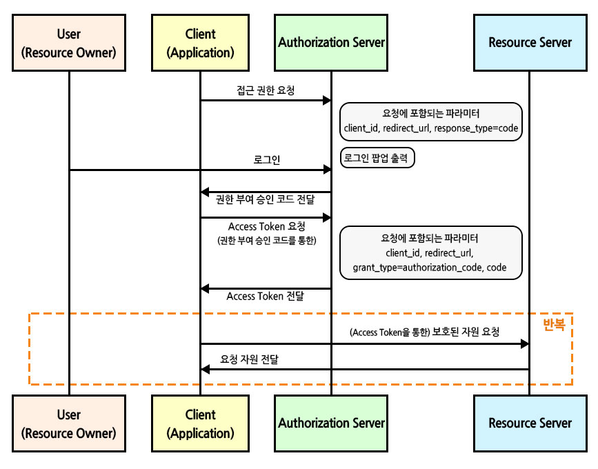
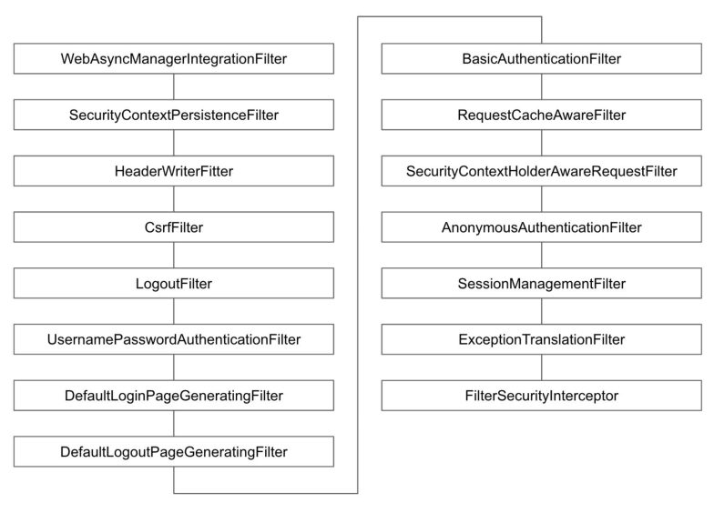
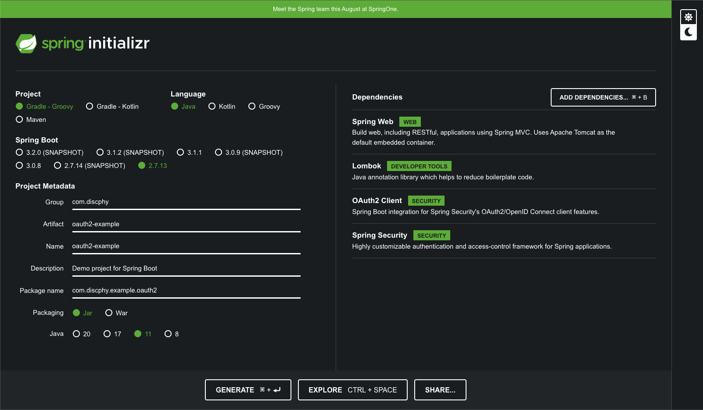
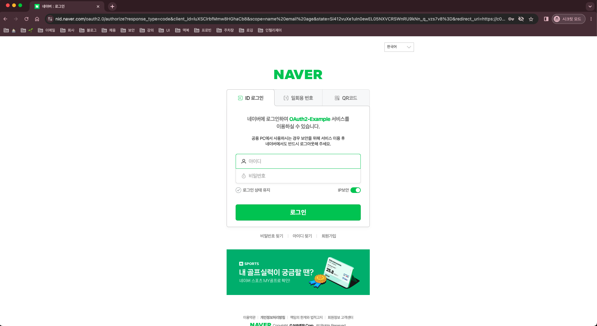
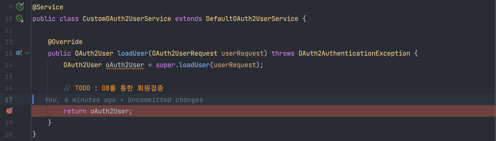
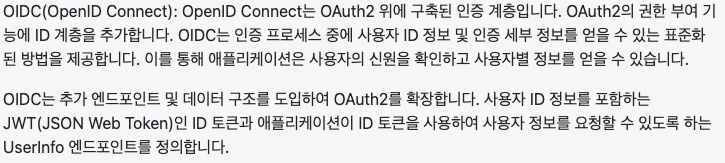

# SNS 로그인 - Spring OAuth2 Client

# `OAuth2`란?

## 개념

---

- **OAuth(Open Authorization)** : 인터넷 사용자들이 비밀번호를 제공하지 않고, 다른 웹사이트 상의 자신들의 정보에 대해 어플리케이션의 접근 권한을 부여할 수 있는 공통적인 수단으로써 사용되는 위임 권한부여를 위한 표준 프로토콜이다.

<aside>
💡 `OAuth2`는 `OAuth`의 알려진 보안 문제 등을 개선한 버전임

</aside>

## 주요 용어

---

| 이름 | 설명 |
| --- | --- |
| Authentication | (인증) 접근 자격이 있는지 검증하는 단계 |
| Authorization | (인가) 자원에 접근할 권한을 부여하는 것이며, 인가가 완료되면 리소스 접근 권한이 담긴 Access Token이 클라이언트에게 부여 |
| Access Token | 리소스 서버에게서 리소스 소유자의 보호된 자원을 획득할 때 사용하는 토큰 |
| Refresh Token | Access Token만료 시 이를 갱신하기 위한 용도로 사용하는 토큰 |

## 구성

---

| 이름 | 설명 |
| --- | --- |
| Resource Owner | 웹 서비스를 이용하려는 유저, 자원(개인정보)을 소유하는 자, 사용자 |
| Client | 자사 또는 개인이 만든 애플리케이션 서버 |
| Resource Server | 사용자의 개인정보를 가지고있는 애플리케이션 (Google, Facebook, Kakao 등) 회사 서버  

- Client는 Token을 이 서버로 넘겨 개인정보를 응답 받을 수 있음 |
| Authorization Server | 권한을 부여(인증에 사용할 아이템을 제공주는)해주는 서버

- 사용자는 이 서버로 ID, PW를 넘겨 Authorization Code를 발급 받을 수 있음
- Client는 이 서버로 Authorization Code을 넘겨 Token을 받급 받을 수 있음 |

## 인증 방식

---

- `Authorization Code Grant`(권한 부여 코드 승인 방식) : `OAuth2`에서 가장 기본이 되는 방식이며, SNS 로그인 기능에서 사용되는 방식
    
    
    
    <Authorization Code Grant 플로우>
    
    1. 접근 권한 요청 시, `response_type=code`로 요청하게 되면 클라이언트는 `Authorization Server`에서 제공하는 로그인 페이지 이동 
    2. 로그인 시,  `Authorization Server`는 접근 권한 요청시에 받은 `redirect_url`로 `Authorization Code`를 전달 
    3. `Client`에서 전달받은 `Authorization Code`로 `Access Token`요청
    4. `Client`에서 전달받은 `Access Token`으로 `Resource Server`에 자원 요청 
    
    > 이외에도 다른 방식이 존재하지만 여기서 설명하지 않겠다.
     
    - `Implicit Grant` : 암묵적 승인 방식
    - `Client Credentials Grant` : 클라이언트 자격 증명 방식
    - `Resource Owner Password Credentials Grant` : 자원 소유자 자격 증명 방식
    
    [참고] : [https://wildeveloperetrain.tistory.com/247](https://wildeveloperetrain.tistory.com/247)
    > 

# `Spring Security` 원리

### `DelegatingProxyChain`

---


<`DelegatingProxy`의 역할>

- 서블릿 필터는 서블릿 컨테이너에서 관리되어 스프링 빈을 사용할 수 없다.
- `DelegatingFilterProxy` : 서블릿 필터와 스프링 빈을 연결해주는 클래스, 서블릿 필터로 요청을 받아서 스프링에서 관리하는 필터에게 요청을 위임하는 역할을 한다.
- `springSecurityFilterChain` : 스프링 시큐리티 스프링 빈

### `FilterChainProxy`

---



<스프링 시큐리티 기본 필터 목록 및 순서>

- `FilterChainProxy`는 각 필터들을 순서대로 호출하며 인증/인가처리 및 각종 요청에 대한 처리를 수행한다.
- 스프링 시큐리티 초기화 시 생성되는 필터들을 관리하고 제어
    - 스프링 시큐리티가 기본적으로 생성하는 필터
    - 설정 클래스에서 `API`추가 시 생성되는 필터
- 사용자의 요청을 필터 순서대로 호출하여 전달
- 사용자정의 필터를 생성해서 기존의 필터 전, 후로 추가 가능
    - 필터의 순서를 잘 정의
    - 마지막 필터까지 인증 및 인가 예외가 발생하지 않으면 보안 통과

> `OAuth2` 로그인을 활성화 하면 `UsernamePasswordAuthenticationFilter` 대신 `OAuth2LoginAuthenticationFilter` 필터가 사용 된다.
> 

### 동작 방식

---


<서블릿 컨테이너와 스프링 컨테이너의 `DelegatingFilterProxy`에 대한 `Flow`>

- `DelegatingFilterProxy`이 요청을 받게되면 `delegate request`로 요청 위임
- `FilterChainProxy`의 필터 목록들 순차적으로 수행
- 필터 완료 시 `DispatcherServlet(Controller)`로 전달

# `Spring OAuth2 Client` 원리

### `Access Token` 획득

---


<사용자 로그인 후 `Access Token`을 발급 받는 `Flow`>

- `Auth-Server`에서 로그인을 완료 하면 설정한 `Redirect URL`로 `Authorization Code`를 전달
- `Authorization Code`를 가지고 `Access Token` 요청
- `Access Token` 발급

### `User Info` 획득

---


<발급 받은 `Access Token`으로 사용자 리소스 정보를 조회하여 인증 전역 객체를 생성하는 `Flow`>

- [위에서 발급 받은](https://www.notion.so/SNS-Spring-OAuth2-Client-a3002d5b3cbe4df2bc0e5f850361b758?pvs=21) `Access Token`으로 사용자 정보 조회
- `SecurityContext`의 인증 객체 저장

# `Spring OAuth2 Client` 실전 예제

<aside>
📖 가장 많이 사용하는 SNS 플랫폼 중 
스프링 부트에서 기본 제공해주는 `Google`, `Facebook`, `Github`와 
이 외의 직접 `Provider` 설정 작업이 필요한 `Kakao`, `Naver`의 SNS 로그인 기능을 예제로 확인해보자.

</aside>

### 프로젝트 생성

---

1. [https://start.spring.io/](https://start.spring.io/) 에서 다음과 같이 예제 프로젝트를 세팅 
2. ‘**GENERATE’**를 클릭하여 프로젝트 저장 ****
    
    
    
    <스프링 부트 프로젝트 생성 페이지에서 예제 프로젝트 설정하는 화면>
    
3. `IDE`를 이용하여 `WAS`를 실행 
4. 다음과 같은 화면 페이지가 확인되면 프로젝트 설정 완료 
    
    
    
    <`localhost:8080` 접속 시 노출되는 화면>
    

### 로컬 호스트 설정

---

<aside>
🚨 SNS 플랫폼에서 `redirect url`을 설정할 때 `https` 프로토콜만 지원하는 경우가 대부분이다. 
`ngrok`이라는 오픈 터널링 프로그램을 사용하여 `public https url`을 세팅하면 가능하다.

</aside>

- `ngrok` 공식 홈페이지 : [https://ngrok.com/](https://ngrok.com/)
- 설치 가이드 : [https://tlog.tammolo.com/posts/ngrok-localtunnel](https://tlog.tammolo.com/posts/ngrok-localtunnel)
- 로컬 `WAS` 실행 후, 터미널 아래 명령어 입력
    
    ```bash
    $ ngrok http 8080
    ```
    
- 다음과 같이 `https://c029-218-152-213-155.ngrok-free.app` 로 터널링이 완료된 것을 확인
    
    
    
    <`ngrok` 실행 화면>
    


- 위의 URL로 접속 시, 다음과 같은 화면 노출 확인
    
    
    
    <`ngrok` 터널링 URL 접속 화면>
    

### SNS 플랫폼 설정

---

<aside>
💡 스프링 공식 홈페이지에서 기본으로 제공하는 Redirect URI 템플릿은 `{baseUrl}/login/oauth2/code/{registrationId}`이다.

</aside>

```
The default redirect URI template is {baseUrl}/login/oauth2/code/{registrationId}. 
The registrationId is a unique identifier for the ClientRegistration.

[참고] : [https://spring.io/guides/tutorials/spring-boot-oauth2/](https://spring.io/guides/tutorials/spring-boot-oauth2/)
```

- 구글 로그인 설정 : [https://console.cloud.google.com/](https://console.cloud.google.com/)
- 페이스북 로그인 설정 : [https://developers.facebook.com/apps](https://developers.facebook.com/apps)
- 깃허브 로그인 설정 : [https://github.com/settings/developers](https://github.com/settings/developers)
- 네이버 로그인 설정 : [https://developers.naver.com/apps](https://developers.naver.com/apps)
- 카카오 로그인 설정 : [https://developers.kakao.com/console/app](https://developers.kakao.com/console/app)

### `CommonOAuth2Provider`

---

- `Spring OAuth2 Client`에서 기본으로 제공하는 플랫폼의 정보값을 가지고 있다.

```java
public enum CommonOAuth2Provider {

	GOOGLE {

		@Override
		public Builder getBuilder(String registrationId) {
			ClientRegistration.Builder builder = getBuilder(registrationId,
					ClientAuthenticationMethod.CLIENT_SECRET_BASIC, DEFAULT_REDIRECT_URL);
			builder.scope("openid", "profile", "email");
			builder.authorizationUri("https://accounts.google.com/o/oauth2/v2/auth");
			builder.tokenUri("https://www.googleapis.com/oauth2/v4/token");
			builder.jwkSetUri("https://www.googleapis.com/oauth2/v3/certs");
			builder.issuerUri("https://accounts.google.com");
			builder.userInfoUri("https://www.googleapis.com/oauth2/v3/userinfo");
			builder.userNameAttributeName(IdTokenClaimNames.SUB);
			builder.clientName("Google");
			return builder;
		}

	},

	GITHUB {

		@Override
		public Builder getBuilder(String registrationId) {
			ClientRegistration.Builder builder = getBuilder(registrationId,
					ClientAuthenticationMethod.CLIENT_SECRET_BASIC, DEFAULT_REDIRECT_URL);
			builder.scope("read:user");
			builder.authorizationUri("https://github.com/login/oauth/authorize");
			builder.tokenUri("https://github.com/login/oauth/access_token");
			builder.userInfoUri("https://api.github.com/user");
			builder.userNameAttributeName("id");
			builder.clientName("GitHub");
			return builder;
		}

	},

	FACEBOOK {

		@Override
		public Builder getBuilder(String registrationId) {
			ClientRegistration.Builder builder = getBuilder(registrationId,
					ClientAuthenticationMethod.CLIENT_SECRET_POST, DEFAULT_REDIRECT_URL);
			builder.scope("public_profile", "email");
			builder.authorizationUri("https://www.facebook.com/v2.8/dialog/oauth");
			builder.tokenUri("https://graph.facebook.com/v2.8/oauth/access_token");
			builder.userInfoUri("https://graph.facebook.com/me?fields=id,name,email");
			builder.userNameAttributeName("id");
			builder.clientName("Facebook");
			return builder;
		}

	}
	...
}
```

### `application.yml` 설정

---

```yaml
spring:
   security:
      oauth2:
         client:
            registration:
               google:
									client-id: #{client-id}
                  client-secret: #{client-secret}
                  redirect-uri: "https://{baseHost}{basePort}/login/oauth2/code/{registrationId}"
               facebook:
                  client-id: #{client-id}
                  client-secret: #{client-secret}
                  redirect-uri: "https://{baseHost}{basePort}/login/oauth2/code/{registrationId}"
               github:
                  client-id: #{client-id}
                  client-secret: #{client-secret}
                  redirect-uri: "https://{baseHost}{basePort}/login/oauth2/code/{registrationId}"
               naver:
                  client-name: Naver
                  client-id: #{client-id}
                  client-secret: #{client-secret}
                  authorization-grant-type: authorization_code
                  redirect-uri: "https://{baseHost}{basePort}/login/oauth2/code/{registrationId}"
                  scope: name,email,age
               kakao:
                  client-name: Kakao
                  client-id: #{client-id}
                  client-secret: #{client-secret}
                  authorization-grant-type: authorization_code
                  redirect-uri: "https://{baseHost}{basePort}/login/oauth2/code/{registrationId}"
                  scope: profile_nickname,account_email
                  client-authentication-method: post
            provider: # 기본제공하지 않는 플랫폼인 경우, 직접 Provider 설정 필요
               naver:
                  authorization_uri: https://nid.naver.com/oauth2.0/authorize
                  token_uri: https://nid.naver.com/oauth2.0/token
                  user-info-uri: https://openapi.naver.com/v1/nid/me
                  user_name_attribute: response
               kakao:
                  authorization_uri: https://kauth.kakao.com/oauth/authorize
                  token_uri: https://kauth.kakao.com/oauth/token
                  user-info-uri: https://kapi.kakao.com/v2/user/me
                  user_name_attribute: id
```

- `#{client-id}`, `#{client-secret}`에는 플랫폼 설정의 보안 정보를 가져와야 한다.
- Naver, Kakao의 경우 기본으로 제공하지 않는 플랫폼으로 직접 `provider`을 설정해야한다.
- `authorization-grant-type` : 인증 방식은 `authorization_code`로 설정
- `scope` : 각 플랫폼 별, 클라이언트에게 허용된 리소스의 동의 항목만 명시하면 된다.

### `Spring Security` 설정 및 활성화

---

```java
@Configuration
@EnableWebSecurity
public class SecurityConfig {

    @Bean
    public SecurityFilterChain config(HttpSecurity http) throws Exception {
        return http
                .authorizeRequests()
                    .antMatchers("/login").permitAll()
                    .anyRequest().authenticated()
                    .and()
                .oauth2Login()
                    .defaultSuccessUrl("/user")
                    .and()
                .build();
    }
}
```

- `/login`만 전체 허용, `/login`을 제외한 나머지 `path`는 인증 과정(즉, 로그인)이 필수
- `oauth2Login()` : `oauth2`를 활성화
- `.defaultSuccessUrl("/user")`: 로그인 성공시의 `/user`로 리다이렉트 한다.

### `/login`

---

- `/login`을 따로 구현하지 않았을 시, 스프링 시큐리티에서 기본 제공되는 `ui`를 그려준다.

```java
public class DefaultLoginPageGeneratingFilter extends GenericFilterBean {
	private void doFilter(HttpServletRequest request, HttpServletResponse response, FilterChain chain) throws IOException, ServletException {
		boolean loginError = isErrorPage(request);
		boolean logoutSuccess = isLogoutSuccess(request);
		if (isLoginUrlRequest(request) || loginError || logoutSuccess) {
			String loginPageHtml = generateLoginPageHtml(request, loginError, logoutSuccess);
			response.setContentType("text/html;charset=UTF-8");
			response.setContentLength(loginPageHtml.getBytes(StandardCharsets.UTF_8).length);
			response.getWriter().write(loginPageHtml);
			return;
		}
		chain.doFilter(request, response);
	}

	private String generateLoginPageHtml(HttpServletRequest request, boolean loginError, boolean logoutSuccess) {
		...
		if (this.oauth2LoginEnabled) { // oauth2Login이 활성화 일 때
			sb.append("<h2 class=\"form-signin-heading\">Login with OAuth 2.0</h2>");
			sb.append(createError(loginError, errorMsg));
			sb.append(createLogoutSuccess(logoutSuccess));
			sb.append("<table class=\"table table-striped\">\n");
			for (Map.Entry<String, String> clientAuthenticationUrlToClientName : this.oauth2AuthenticationUrlToClientName
					.entrySet()) {
				sb.append(" <tr><td>");
				String url = clientAuthenticationUrlToClientName.getKey();
				sb.append("<a href=\"").append(contextPath).append(url).append("\">");
				String clientName = HtmlUtils.htmlEscape(clientAuthenticationUrlToClientName.getValue());
				sb.append(clientName);
				sb.append("</a>");
				sb.append("</td></tr>\n");
			}
			sb.append("</table>\n");
		}
		...
	}
}
```

- `WAS` 실행 후, `/login`에 접속하면 아래와 같은 페이지가 노출 되는 것을 확인할 수 있다.


<`/login` 페이지 화면>


### `/user`

---

```java
@RestController
@RequestMapping("/user")
public class UserController {

    @GetMapping
    public OAuth2User user(@AuthenticationPrincipal OAuth2User user) {
        return user;
    }
}
```

- `@AuthenticationPrincipal` : 현재 인증된 사용자에 대한 정보에 쉽게 접근 해주는 어노테이션
- `OAuth2User`를 직접`return`하여 인증객체를 `JSON`으로 확인 가능하다.

### 로그인 과정 예시 - 네이버

---

- Naver 클릭


<스프링 시큐리티에서 제공하는 로그인 템플릿>

- 네이버 로그인 페이지 이동



<네이버 로그인 화면>

- 로그인 과정을 거쳐 성공 시에 `/user`로 리다이렉트 되는 것을 확인 할 수 있다.


<`/user`로 전달된 인증 객체 확인>

# `Spring OAuth2 Client` 심화 예제

<aside>
💡 간단 예제의 경우, 단순 SNS 로그인을 진행 후 `Spring Context`에 인증 객체를 생성해 로그인을 하는 과정만을 나타낸 것이다.
대부분의 **퍼블릭 서비스**는 `DB`의 회원 테이블 검증을 통해 실제 회원인지 확인을 하거나 추가적으로 회원 정보를 받아 회원가입을 진행해야하는 **요구 사항**이 존재 한다. 

이러한 요구사항 때문에 로그인 하는 과정 작업 중에 있어 커스텀을 해야되는 이슈를 심화 예제를 통해 알아 보겠다.

</aside>

### `UserDetailsService`

---

- `UserDetailsService` : 일반적인 `Form(HTML)`을 이용한 로그인은 유저정보를 가져오는 인터페이스이다.
- `UserDetails` : `UserDetailsService`의 `loadUserByUsername` 리턴 값으로, 유저정보를 담는 객체이다.

```java
public interface UserDetailsService {
	UserDetails loadUserByUsername(String username) throws UsernameNotFoundException;
}
```

> [참고]

`UserDetailsService` : [https://docs.spring.io/spring-security/reference/servlet/authentication/passwords/user-details-service.html](https://docs.spring.io/spring-security/reference/servlet/authentication/passwords/user-details-service.html)
`UserDetails` : [https://docs.spring.io/spring-security/reference/servlet/authentication/passwords/user-details.html](https://docs.spring.io/spring-security/reference/servlet/authentication/passwords/user-details.html)
> 

### `OAuth2` - `UserDetailsService`

---

- `OAuth2`에서 사용하는 `UserDetailsService`는 `OAuth2UserService`이다.
- `OAuth2UserRequest` : 유저정보 API를 호출하는 요청 객체를 인자 값으로 가지고 있다.
- `OAuth2User`를 상속 받은 객체를 반환

```java
@FunctionalInterface
public interface OAuth2UserService<R extends OAuth2UserRequest, U extends OAuth2User> {
	U loadUser(R userRequest) throws OAuth2AuthenticationException;
}
```

- `DefaultOAuth2UserService` : `OAuth2`에서는 기본적으로 `OAuth2UserService` 구현 클래스를 제공해주고 있다.
- `loadUser(OAuth2UserRequest userRequest)` : 코드를 보면 `CommonOAuth2Provider` 또는 `application.yml`에서 설정한 `provider`의 `user-info-url`의 `API`를 호출해 전달 받은 `Response`값을 `DefaultOAuth2User`객체로 변환하여 반환 하고 있는 것을 확인할 수 있다.

```java
public class DefaultOAuth2UserService implements OAuth2UserService<OAuth2UserRequest, OAuth2User> {
	...
	@Override
	public OAuth2User loadUser(OAuth2UserRequest userRequest) throws OAuth2AuthenticationException {
		Assert.notNull(userRequest, "userRequest cannot be null");
		if (!StringUtils.hasText(userRequest.getClientRegistration().getProviderDetails().getUserInfoEndpoint().getUri())) {
			OAuth2Error oauth2Error = new OAuth2Error(MISSING_USER_INFO_URI_ERROR_CODE,
					"Missing required UserInfo Uri in UserInfoEndpoint for Client Registration: "
							+ userRequest.getClientRegistration().getRegistrationId(),
					null);
			throw new OAuth2AuthenticationException(oauth2Error, oauth2Error.toString());
		}
		String userNameAttributeName = userRequest.getClientRegistration().getProviderDetails().getUserInfoEndpoint()
				.getUserNameAttributeName();
		if (!StringUtils.hasText(userNameAttributeName)) {
			OAuth2Error oauth2Error = new OAuth2Error(MISSING_USER_NAME_ATTRIBUTE_ERROR_CODE,
					"Missing required \"user name\" attribute name in UserInfoEndpoint for Client Registration: "
							+ userRequest.getClientRegistration().getRegistrationId(),
					null);
			throw new OAuth2AuthenticationException(oauth2Error, oauth2Error.toString());
		}
		RequestEntity<?> request = this.requestEntityConverter.convert(userRequest);
		ResponseEntity<Map<String, Object>> response = getResponse(userRequest, request);
		Map<String, Object> userAttributes = response.getBody();
		Set<GrantedAuthority> authorities = new LinkedHashSet<>();
		authorities.add(new OAuth2UserAuthority(userAttributes));
		OAuth2AccessToken token = userRequest.getAccessToken();
		for (String authority : token.getScopes()) {
			authorities.add(new SimpleGrantedAuthority("SCOPE_" + authority));
		}
		return new DefaultOAuth2User(authorities, userAttributes, userNameAttributeName);
	}
	...
}
```

### `DefaultOAuth2UserService` - 사용자화

---

- `OAuth2UserService` 인터페이스를 직접 구현할수도 있지만,  유저정보를 가져오는 `API` 로직도 구현을 해야되는 어려움이 있어 다음 예제에서는 `DefaultOAuth2UserService`를 상속받아서 구현해보자.
- 지금 예제에서는 `DB`를 통한 회원검증을 진행하지는 않지만, 필요하다면 별도로 구현이 필요하다.

```java
@Service
public class CustomOAuth2UserService extends DefaultOAuth2UserService {

    @Override
    public OAuth2User loadUser(OAuth2UserRequest userRequest) throws OAuth2AuthenticationException {
        OAuth2User oAuth2User = super.loadUser(userRequest);

        // TODO : DB를 통한 회원검증

        return oAuth2User;
    }
}
```

- `CustomOAuth2UserService`등록

```java
@Configuration
@EnableWebSecurity
@RequiredArgsConstructor
public class SecurityConfig {

    private final CustomOAuth2UserService userService;

    @Bean
    public SecurityFilterChain config(HttpSecurity http) throws Exception {
        return http
                .authorizeRequests()
                    .antMatchers("/login").permitAll()
                    .anyRequest().authenticated()
                    .and()
                .oauth2Login()
                    .userInfoEndpoint()
                        .userService(userService)
                        .and()
                    .defaultSuccessUrl("/user")
                    .and()
                .build();
    }
}
```

- `WAS`를 디버깅 모드로 실행시켜 제대로 적용이 되었는지 확인해보자.



# `OpenID Connect(OIDC)`

<aside>
⚠️ Google의 경우 `break`가 안 걸리는 것을 확인할 수 있다. (설정한 나머지 플랫폼들은 정상적으로 `break`가 걸린다.)
이유는 Google은 `OpenID Connect` 방식으로 작동되기 때문이다.

</aside>

- 아래는, ChatGPT에게 “`OAuth2` vs `OIDC`” 키워드로 물어본 답변의 일부분이다.
- 즉, `OAuth2` 기반이지만 다른 인증 방식이다.
- 권한 요청시에, `scope` 값에 `openid`가 포함 되어 있다면 `OIDC` 방식으로 인증 진행



<“OAuth2 vs OIDC”의 검색 결과 - ChatGPT>

> [참고] : [https://webapp.chatgpt4google.com/s/MjYzMTU5](https://webapp.chatgpt4google.com/s/MjYzMTU5)
> 

- Google의 설정 정보를 다시 살펴보면, `scope`에 `openid`가 포함되어있는걸 확인 할 수 있다.

```java
GOOGLE {

		@Override
		public Builder getBuilder(String registrationId) {
			ClientRegistration.Builder builder = getBuilder(registrationId,
					ClientAuthenticationMethod.CLIENT_SECRET_BASIC, DEFAULT_REDIRECT_URL);
			builder.scope("openid", "profile", "email"); // openid 포함 
			builder.authorizationUri("https://accounts.google.com/o/oauth2/v2/auth");
			builder.tokenUri("https://www.googleapis.com/oauth2/v4/token");
			builder.jwkSetUri("https://www.googleapis.com/oauth2/v3/certs");
			builder.issuerUri("https://accounts.google.com");
			builder.userInfoUri("https://www.googleapis.com/oauth2/v3/userinfo");
			builder.userNameAttributeName(IdTokenClaimNames.SUB);
			builder.clientName("Google");
			return builder;
		}

	}
```

### `OidcUserService` - 사용자화

---

- `Spring OAuth2 Client`에서 `OAuth2`의 `DefaultOAuth2UserService`와 마찬가지로 `OIDC`는 `OidcUserService`를 구현 클래스로 제공해주고 있다.
- `OAuth2UserService`을 상속받고 타입 매개변수가 `OIDC`관련 객체인 것을 확인할 수 있다.
- `OidUser` 또한 `OAuth2User`를 상속받고 있다.

```java
public class OidcUserService implements OAuth2UserService<OidcUserRequest, OidcUser> {
	...
	@Override
	public OidcUser loadUser(OidcUserRequest userRequest) throws OAuth2AuthenticationException {
		Assert.notNull(userRequest, "userRequest cannot be null");
		OidcUserInfo userInfo = null;
		if (this.shouldRetrieveUserInfo(userRequest)) {
			OAuth2User oauth2User = this.oauth2UserService.loadUser(userRequest);
			Map<String, Object> claims = getClaims(userRequest, oauth2User);
			userInfo = new OidcUserInfo(claims);
			// https://openid.net/specs/openid-connect-core-1_0.html#UserInfoResponse
			// 1) The sub (subject) Claim MUST always be returned in the UserInfo Response
			if (userInfo.getSubject() == null) {
				OAuth2Error oauth2Error = new OAuth2Error(INVALID_USER_INFO_RESPONSE_ERROR_CODE);
				throw new OAuth2AuthenticationException(oauth2Error, oauth2Error.toString());
			}
			// 2) Due to the possibility of token substitution attacks (see Section
			// 16.11),
			// the UserInfo Response is not guaranteed to be about the End-User
			// identified by the sub (subject) element of the ID Token.
			// The sub Claim in the UserInfo Response MUST be verified to exactly match
			// the sub Claim in the ID Token; if they do not match,
			// the UserInfo Response values MUST NOT be used.
			if (!userInfo.getSubject().equals(userRequest.getIdToken().getSubject())) {
				OAuth2Error oauth2Error = new OAuth2Error(INVALID_USER_INFO_RESPONSE_ERROR_CODE);
				throw new OAuth2AuthenticationException(oauth2Error, oauth2Error.toString());
			}
		}
		Set<GrantedAuthority> authorities = new LinkedHashSet<>();
		authorities.add(new OidcUserAuthority(userRequest.getIdToken(), userInfo));
		OAuth2AccessToken token = userRequest.getAccessToken();
		for (String authority : token.getScopes()) {
			authorities.add(new SimpleGrantedAuthority("SCOPE_" + authority));
		}
		return getUser(userRequest, userInfo, authorities);
	}
	...
}
```

```java
public interface OidcUser extends OAuth2User, IdTokenClaimAccessor {
	...
}
```

- [위에서 작성한](https://www.notion.so/SNS-Spring-OAuth2-Client-a3002d5b3cbe4df2bc0e5f850361b758?pvs=21) `CustomOAuth2UserService`와 비슷하게 `CustomOidcUserService`를 작성해보자

```java
@Service
public class CustomOidcUserService extends OidcUserService {

    @Override
    public OidcUser loadUser(OidcUserRequest userRequest) throws OAuth2AuthenticationException {
        OidcUser oidcUser = super.loadUser(userRequest);

        // TODO : DB를 통한 회원검증

        return oidcUser;
    }
}
```

- `CustomOidcUserService` 등록

```java
@Configuration
@EnableWebSecurity
@RequiredArgsConstructor
public class SecurityConfig {

    private final CustomOAuth2UserService userService;
    private final CustomOidcUserService oidcUserService;

    @Bean
    public SecurityFilterChain config(HttpSecurity http) throws Exception {
        return http
                .authorizeRequests()
                    .antMatchers("/login").permitAll()
                    .anyRequest().authenticated()
                    .and()
                .oauth2Login()
                    .userInfoEndpoint()
                        .userService(userService)
                        .oidcUserService(oidcUserService)
                        .and()
                    .defaultSuccessUrl("/user")
                    .and()
                .build();
    }
}
```

- 등록 후, `breakpoint`를 설정하고 `WAS`를 디버그 모드로 실행을 해보면 Google일 때도 `break` 걸리는 것을 확인할 수 있다.

이렇게 `Spring OAuth2 Client`를 간단히(?) 알아봤는데… 
더욱 상세하게 들어가면 이 글이 끝나지 않을 것 같아 여기서 마무리 하겠다. 😂

(*너무 내용이 딱딱하고 진지해서 재미가 없어 걱정이 된다….*)

조금이나마, `Spring OAuth2 Client`의 개념에 대한 이해와 예제 들을 통해 돕기 위해 작성한 글이다. 
**참고**와 **출처**를 통해 더 디테일하게 알아 보는 것을 권장하고, 학습 후 서비스에 적용하기를 바란다. 

위의 예제에서는 5개의 로그인 플랫폼을 연동 시켜봤는데, 
이 외에도 댓글로 Twitter, Apple, Weibo 등 요청이 다수 들어오면 다음 포스트에서 소개 하도록 하겠다. 


[출처]

[https://velog.io/@tmdgh0221/Spring-Security-와-OAuth-2.0-와-JWT-의-콜라보](https://velog.io/@tmdgh0221/Spring-Security-%EC%99%80-OAuth-2.0-%EC%99%80-JWT-%EC%9D%98-%EC%BD%9C%EB%9D%BC%EB%B3%B4)

[https://catsbi.oopy.io/f9b0d83c-4775-47da-9c81-2261851fe0d0](https://catsbi.oopy.io/f9b0d83c-4775-47da-9c81-2261851fe0d0)

[https://inpa.tistory.com/entry/WEB-📚-OAuth-20-개념-💯-정리](https://inpa.tistory.com/entry/WEB-%F0%9F%93%9A-OAuth-20-%EA%B0%9C%EB%85%90-%F0%9F%92%AF-%EC%A0%95%EB%A6%AC)

[Github]

[https://github.com/discphy/oauth2-example](https://github.com/discphy/oauth2-example)