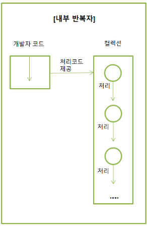
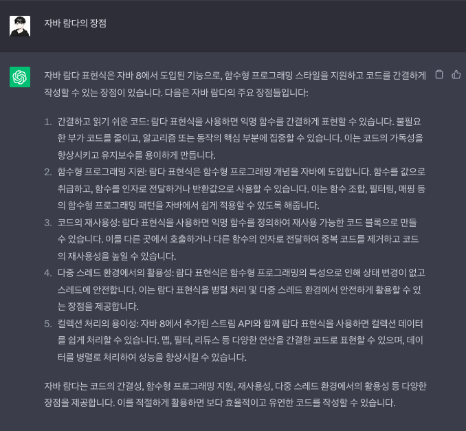
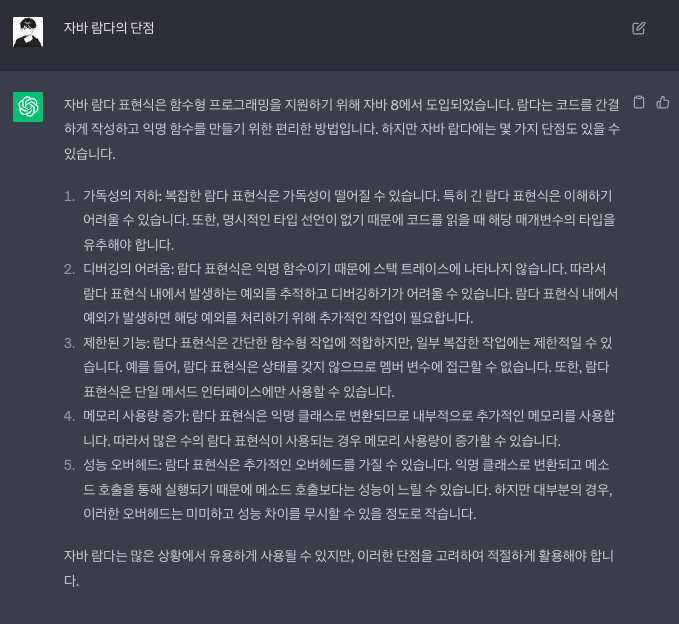

# 람다를 사용해야 되는 이유

### 람다와 스트림의 개념

---

들어가기 앞서서, 람다식과, 람다하면 빼놓을 수 없는 스트림의 개념을 정리해보자.

**람다식**은 하나의 표현법으로 익명 함수를 간결하게 표현하는 방법이다. 

→ 자바 8부터 도입된 함수형 프로그래밍을 지원하기 위한 기능이다. 

표현법은 다음과 같다.

```java
(매개변수1, 매개변수2, ...) -> { 구현 }
```

**스트림**이란 마찬가지로 자바 8부터 도입된 기능으로, 컬렉션을 처리하고 다양한 연산을 수행하는데 사용하는 API이다. 

주로 컬렉션의 저장된 요소를 하나씩 참조하여 람다식으로 처리할 수 있다. 

그렇기 때문에 람다와 스트림은 밀접한 관계를 가지고 있다.

아래의 첨부한 사진을 보면 이해가 쉽다. 

다음 사진은, 일반적으로 컬렉션 요소를 처리할때 사용하는 `for`문에서 사용하는 외부 반복자, 그리고 `Stream`에서 사용하는 내부 반복자이다.


반복이 외부에서 일어남 (for문)



반복이 내부에서 일어남 (Stream)

### 스트림의 주요 기능

---

- 필터링(`Filtering`): 주어진 조건에 맞는 요소를 선택
- 매핑(`Mapping`): 요소를 다른 값으로 변환하거나 추출
- 정렬(`Sorting`): 요소를 정렬
- 리듀싱(`Reducing`): 요소들을 결합하여 단일 결과를 도출
- 집계(`Aggregating`): 요소들을 그룹화하거나 통계 정보를 계산

> 자세한 건 아래의 람다와 스트림의 예제를 통해서 알아보도록 하자.
> 

### 람다의 장단점

---

그러면, 람다를 왜 사용해야되는지 또 무슨 장점이 있는지에 대해서 알아보자. 

개발자라면 누구나 사용하는(?) `ChatGPT`에게 물어보았다. 



“자바 람다의 장점”이라고 ChatGPT에게 물어본 답안이다.

정리하자면, 

- 간결하고 읽기 쉬운 코드
- 함수형 프로그래밍 지원
- 코드의 재사용성
- 다중 스레드 환경에서의 활용성
- 컬렉션 처리의 용이성

등등 여러가지 장점들 때문에 주로 사용한다. 

위의 장점 중에서도 필자는 특히 코드의 간결성, 가독성 때문에 주로 사용한다. 

반면에, **람다의 단점**을 알아보자. 



“자바 람다의 단점”이라고 ChatGPT에게 물어본 답안이다.

- 가독성의 저하
- 디버깅의 어려움
- 제한된 기능
- 메모리 사용량 증가
- 성능 오버헤드

필자가 느끼기에는 위의 단점 중에서 *제한된 기능, 디버깅의 어려움*이 가장 큰 단점이라고 생각한다.

하지만, 이 단점이 개발하는데 있어 치명적이진 않다고 생각한다.   **

<aside>
⚠️ 제한된 기능 : 병렬 프로그래밍 방식이라 멤버 변수의 재사용이 불가능 하다는 단점

예를 들면, 컬렉션의 내부 반복자에 의해서 실행이 되기 때문에 멤버변수의 재사용이 불가능하다. (`final`로 정적변수로는 사용이 가능)

</aside>

### 람다와 스트림 예제

---

이 글을 보는 독자는 대부분이 개발자일 것 같아 코드를 보는게 더 이해가 빠를거라고(?) 생각되어 예제를 통해 설명하고자 한다. 

**스트림 API** 중 가장 많이 사용하는 기능을 예제로 작성하였다. (예제는 `JUnit5`를 이용한 테스트 코드로 작성하였다. )

예시에 필요한 **상품(`Item`)**이라는 객체를 만들었다. 

```java
//Item.java

@Data
@AllArgsConstructor
public class Item {

    private Long id; // 아이디
    private String itemName; // 상품명
    private Integer price; // 상품가격
    private Integer quantity; // 상품수량
}
```

테스트에 필요한 데이터를 전역 변수로 선언을 하고 예제를 작성하겠다.

```java
static List<Item> items = Arrays.asList(
      new Item(1L, "책A", 10000, 10),
      new Item(2L, "책B", 20000, 20),
      new Item(3L, "자동차A", 1000000, 3),
      new Item(4L, "자동차B", 2000000, 5),
      new Item(5L, "음식A", 8000, 150),
      new Item(6L, "음식B", 9000, 200),
      new Item(7L, "음식C", 10000, 300),
      new Item(8L, "노트북A", 100000, 20),
      new Item(9L, "노트북B", 40000, 40)
);
```

1. **단순 출력**
    
    먼저, 일반적인 출력방식을 예제로 들었다. (`for`)
    
    ```java
    //ItemPrintServiceTest.java
    
    @Test
    void 일반_아이템_출력_V_1() {
        for (int i = 0; i < items.size(); i++) {
            System.out.println("item = " + items.get(i));
        }
    }
    
    @Test
    void 일반_아이템_출력_V_2() {
        for (Item item : items) {
            System.out.println("item = " + item);
        }
    }
    ```
    
    위의 코드는 기존에 사용했던 일반적인 반복문이다. 
    
    그럼, 이제 람다를 이용한 예제를 살펴보자. 
    
    ```java
    //ItemPrintServiceTest.java
    
    @Test
    void 람다_아이템_출력_V_1() {
        items.forEach(item -> System.out.println("item = " + item));
    }
    
    @Test
    void 람다_아이템_출력_참조_V_2() {
        items.forEach(this::print); // 메서드 참조 : 매개변수가 동일할 때 사용가능하다. 
    }
    
    void print(Item item) {
        System.out.println("item = " + item);
    }
    ```
    
    람다를 사용한 예제 중 `람다_아이템_출력_참조_V_2` 를 보면 일반적인 코드보다 훨씬 더 간결해진 것을 확인할 수 있다.
    
    <aside>
    💡 람다식에서의 메소드 **참조**는 불필요한 매개변수를 생략 하는 것이다. 
    
    [참고] [https://inpa.tistory.com/entry/JAVA8-☕-람다식을-더-짧게-메소드-참조Method-Reference](https://inpa.tistory.com/entry/JAVA8-%E2%98%95-%EB%9E%8C%EB%8B%A4%EC%8B%9D%EC%9D%84-%EB%8D%94-%EC%A7%A7%EA%B2%8C-%EB%A9%94%EC%86%8C%EB%93%9C-%EC%B0%B8%EC%A1%B0Method-Reference)
    
    </aside>
    
2. `filter()` - 필터 
    
    `filter()`는 `return`값이 `true`인것들만 추출하는 메소드이다.
    
    아래는, 스트림 API의 `filter()` 메소드 기능을 테스트 코드로 작성하였다. 
    
    ```java
    //ItemFilterServiceTest.java
    
    @Test
    void for_상품명이_자동차인것들만_필터링() {
    		//given
        List<Item> cars = new ArrayList<>();
    
    		//when
        for (Item item : items) {
            if (item.getItemName().contains("자동차")) {
    						cars.add(item);
    				}
        }
    
        //then
        assertThat(cars).hasSize(2);
    }
    
    @Test
    void 스트림_상품명이_자동차인것들만_필터링() {
        //when
        List<Item> cars = items.stream().filter(item -> item.getItemName().contains("자동차")).collect(toList());
    
        //then
        assertThat(cars).hasSize(2);
    }
    ```
    
    `for_상품명이_자동차인것들만_필터링()` 를 보면 `for`문안에 `if`문이 또 들어가 코드가 다소 복잡해 보일 수 있다.
    
    반면에, `스트림_상품명이_자동차인것들만_필터링()`를 보면 기존의 3줄 이상의 코드에서 1줄 짜리 코드로 바뀐 것을 확인 할 수 있다.
    
    <aside>
    💡 필자는 자바 컨벤션이 코드 문화에 있어서 중요하다고 생각합니다. 
    
    자바 컨벤션의 규칙 중 ”**`indent`(인덴트, 들여쓰기) `depth`를 2가 넘지않도록 구현한다. 1까지만 허용”** 규칙이 있는데 
    
    **위의 예제를 보면** 기본 반복문을 사용했을 때는 위의 컨벤션을 위반하지만, 람다를 사용하면 컨벤션을 지킬 수 있다!
    
    [참고] [https://discphy-blog.tistory.com/1](https://discphy-blog.tistory.com/1)
    
    </aside>
    
    `filter()`를 여러 번 사용한 예제이다. 
    
    ```java
    //ItemFilterServiceTest.java
    
    @Test
    void 상품명이_음식이면서_가격이_8500원_이상인것들만_필터링() {
        //when
        List<Item> foods = items.stream()
                .filter(item -> item.getItemName().contains("음식"))
                .filter(item -> item.getPrice() > 8500)
                .collect(toList());
        /*
         * 아래와 같이 사용해도 된다.
         * .filter(item -> item.getItemName().contains("음식") && item.getPrice() > 8500))
         */
    
        //then
        assertThat(foods).hasSize(2);
    }
    ```
    
    위와같이 `filter()`를 한번 뿐이 아닌 여러 번 사용이 가능하다. 
    
    마지막으로, 컬렉션의 중복 제거도 가능하다. `distinct()`를 사용하면 중복 제거가 가능하다. 
    
    ```java
    //ItemFilterServiceTest.java
    
    @Test
    void 상품가격_필터링_중복_제거() {
    	//when
        List<Integer> prices = items.stream()
                .map(Item::getPrice) // 뒤에서 설명할 map() 메소드이며 참조를 이용하였다.
                .distinct()
                .collect(toList());
    
        //then
        assertThat(prices).hasSize(8); // 10000원 중복 제거 9 - 1 = 8
        assertThat(prices).containsExactly(10000, 20000, 1000000, 2000000, 8000, 9000, 100000, 40000);
    }
    ```
    

1. `map()` - 매핑
    
    `map()`은 말그대로 매핑을 하는 기능이며, 컬렉션의 요소값을 변경하는 것이라고 보면된다.
    
    실제로 가장 많이 사용하는 스트림 API이다. 
    
    상품명만을 추출하는 간단한 람다의 예제부터 소개하겠다. 
    
    ```java
    //ItemMappingServiceTest.java
    
    @Test
    void 람다_상품명만_나열() {
    		//when
        List<String> itemNames = items.stream()
                .map(Item::getItemName)
                .collect(Collectors.toList());
    
        //then
        assertThat(itemNames).containsExactly("책A",
                "책B",
                "자동차A",
                "자동차B",
                "음식A",
                "음식B",
                "음식C",
                "노트북A",
                "노트북B");
    }
    ```
    
    아래와 같이, 컬렉션 요소의 객체 메소드 뿐만아니라 직접 메소드를 만들어 매핑도 가능하다. (정적 메소드도 가능)
    
    ```java
    //ItemMappingServiceTest.java
    
    @Test
    void for_상품명이_책인_상품을_수량을_0개로() {
    		//given
        List<Item> books = new ArrayList<>();
    
        //when
        for (Item item : items) {
            if (item.getItemName().contains("책")) {
                books.add(soldOutItem(item));
            }
        }
    
    	//then
        assertThat(books).hasSize(2);
        assertThat(books).extracting("quantity").containsOnly(0);
    }
    
    @Test
    void 람다_상품명이_책인_상품을_수량을_0개로() {
        //when
        List<Item> books = items.stream()
                .filter(item -> item.getItemName().contains("책"))
                .map(this::soldOutItem)
                .collect(Collectors.toList());
    
    		//then
        assertThat(books).hasSize(2);
        assertThat(books).extracting("quantity").containsOnly(0);
    }
    
    private Item soldOutItem(Item item) {
        item.setQuantity(0);
        return item;
    }
    ```
    

1. `sorted()` - 정렬
    
    
    테스트의 메소드 명처럼 **상품을 가격 순으로 정렬 후 최솟값을 추출**하는 예제이다. 
    
    ```java
    //ItemSortServiceTest.java
    
    @Test
    void 정렬_상품가격순_정렬_후_최솟값_V_1() {
    		//given
        items.sort(new Comparator<Item>() {
            @Override
            public int compare(Item o1, Item o2) {
                return o1.getPrice().compareTo(o2.getPrice());
            }
        });
    
        //when
        Item firstItem = items.get(0);
        System.out.println("firstItem = " + firstItem);
    
        //then
        assertThat(firstItem.getId()).isEqualTo(5L);
        assertThat(firstItem.getItemName()).isEqualTo("음식A");
        assertThat(firstItem.getPrice()).isEqualTo(8000);
    }
    
    @Test
    void 정렬_상품가격순_정렬_후_최솟값_V_2() {
    		//given
        items.sort((o1, o2) -> o1.getPrice().compareTo(o2.getPrice()));
    
        //when
        Item firstItem = items.get(0);
        System.out.println("firstItem = " + firstItem);
    
        //then
        assertThat(firstItem.getId()).isEqualTo(5L);
        assertThat(firstItem.getItemName()).isEqualTo("음식A");
        assertThat(firstItem.getPrice()).isEqualTo(8000);
    }
    
    @Test
    void 정렬_상품가격순_정렬_후_최솟값_V_3() {
    		//given
        items.sort(Comparator.comparing(Item::getPrice));
    
        //when
        Item firstItem = items.get(0);
        System.out.println("firstItem = " + firstItem);
    
        //then
        assertThat(firstItem.getId()).isEqualTo(5L);
        assertThat(firstItem.getItemName()).isEqualTo("음식A");
        assertThat(firstItem.getPrice()).isEqualTo(8000);
    }
    
    @Test
    void 스트림_정렬_상품가격순_정렬_후_최솟값() {
        //when
        Item firstItem = items.stream().min(Comparator.comparing(Item::getPrice)).get();
        System.out.println("firstItem = " + firstItem);
    
        //then
        assertThat(firstItem.getId()).isEqualTo(5L);
        assertThat(firstItem.getItemName()).isEqualTo("음식A");
        assertThat(firstItem.getPrice()).isEqualTo(8000);
    }
    ```
    
    4개의 테스트 코드는 다 동일한 기능을 하는 것이다. 
    
    위에서 아래로 예제의 코드가 더욱 간결해지는 것을 느낄 수 있을 것이다. 
    
    이게바로 람다의 위력이 아닐까라는 생각이든다. 
    
2. `collect()` - 집계
    
    예제를 위해 상품 객체에 카테고리를 추가하였다. 
    
    ```java
    //ItemCategory.java
    
    @Data
    @AllArgsConstructor
    public class ItemCategory {
    
        private Long id;
        private String itemName;
        private Category category;
        private Integer price;
        private Integer quantity;
    }
    ```
    
    ```java
    //Category.java
    
    public enum Category {
        BOOK, CAR, FOOD, LAPTOP
    }
    ```
    
    이번에는, 상품을 카테고리 별로 그룹을 만들어보는 예제이다. 
    
    ```java
    //ItemAggregationServiceTest.java
    
    static List<ItemCategory> items = Arrays.asList(
            new ItemCategory(1L, "책A", BOOK, 10000, 10),
            new ItemCategory(2L, "책B", BOOK, 20000, 20),
            new ItemCategory(3L, "자동차A", CAR, 1000000, 3),
            new ItemCategory(4L, "자동차B", CAR, 2000000, 5),
            new ItemCategory(5L, "음식A", FOOD, 8000, 150),
            new ItemCategory(6L, "음식B", FOOD, 9000, 200),
            new ItemCategory(7L, "음식C", FOOD, 10000, 300),
            new ItemCategory(8L, "노트북A", LAPTOP, 100000, 20),
            new ItemCategory(9L, "노트북B", LAPTOP, 40000, 40)
    );
    
    @Test
    void 일반_상품_카테고리_그룹핑() {
        //given
        Map<Category, List<ItemCategory>> itemGroups = new HashMap<>();
    
        for (Category category : Category.values()) {
            itemGroups.put(category, new ArrayList<>());
        }
    
        //when
        for (ItemCategory item : items) {
            itemGroups.get(item.getCategory()).add(item);
        }
    
        //then
        assertThat(itemGroups.keySet()).contains(BOOK, CAR, FOOD, LAPTOP);
        assertThat(itemGroups.get(BOOK).size()).isEqualTo(2);
        assertThat(itemGroups.get(CAR).size()).isEqualTo(2);
        assertThat(itemGroups.get(FOOD).size()).isEqualTo(3);
        assertThat(itemGroups.get(BOOK).size()).isEqualTo(2);
    }
    
    @Test
    void 스트림_상품_카테고리_그룹핑() {
        //when
        Map<Category, List<ItemCategory>> itemGroups = items.stream().collect(groupingBy(ItemCategory::getCategory));
    
        //then
        assertThat(itemGroups.keySet()).contains(BOOK, CAR, FOOD, LAPTOP);
        assertThat(itemGroups.get(BOOK).size()).isEqualTo(2);
        assertThat(itemGroups.get(CAR).size()).isEqualTo(2);
        assertThat(itemGroups.get(FOOD).size()).isEqualTo(3);
        assertThat(itemGroups.get(BOOK).size()).isEqualTo(2);
    }
    ```
    
    카테고리 별로 그룹을 짓기 위해선 `for`문을 여러번 써야되는 이슈가있지만, 
    
    `스트림_상품_카테고리_그룹핑()`보면 알겠지만, 스트림 API와 `Collectors.groupingBy()`을 이용하여 한줄로 그룹핑을 할 수 있다.
    

위의 예제 이외에도 스트림 API가 “오 이거 까지 가능해?”라는 물음표가 뜰 정도로 많은 기능을 제공하고 있다. 

<aside>
💡 **출처**의 공식문서를 보면 많은 스트림 API들이 있다.

</aside>

자바가 계속 업그레이드 되면서 함수형 인터페이스를 많이 추구하고 권장하고있다.

그래서, 람다와 스트림은 권장이 아닌 필수가 되고있다. 

그렇지만 또 남용은 하면 안되기 때문에 잘 학습하고 활용했으면 좋겠다. 

위의 예제 소스들은 개인 깃허브에 업로드 하였으니 참고 바란다. 

[출처]

[https://docs.oracle.com/javase/8/docs/api/java/util/stream/Stream.html](https://docs.oracle.com/javase/8/docs/api/java/util/stream/Stream.html)

[https://steady-coding.tistory.com/598](https://steady-coding.tistory.com/598)

[Github]

[https://github.com/discphy/stream-example](https://github.com/discphy/stream-example)