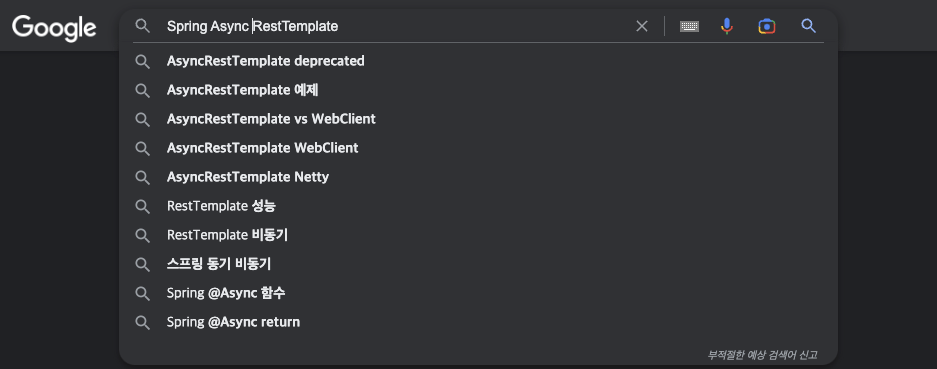
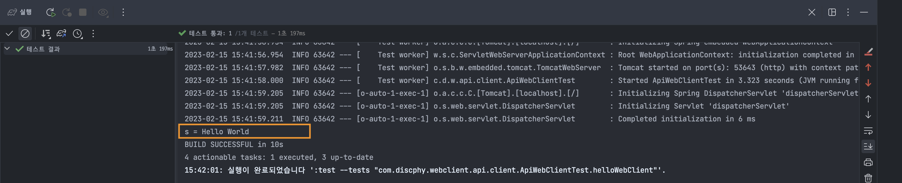
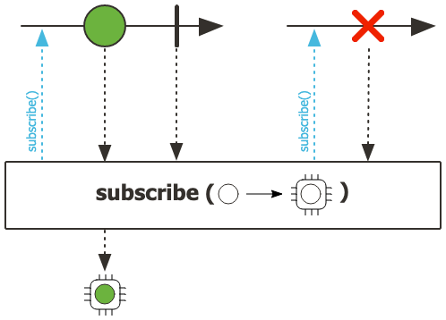
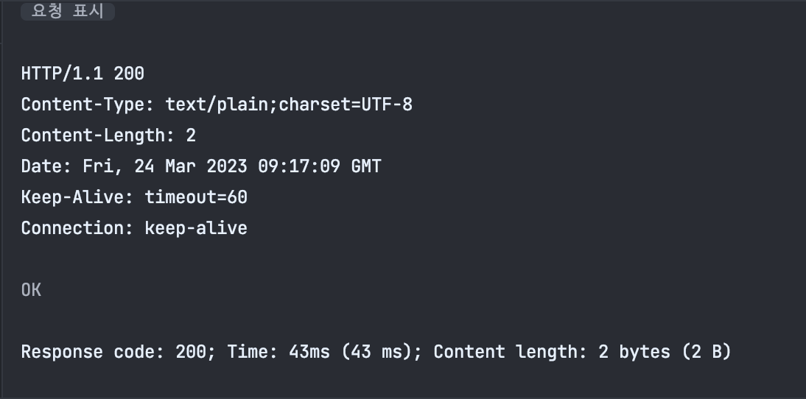
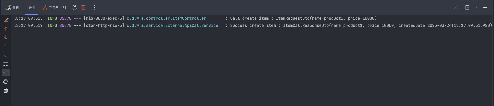
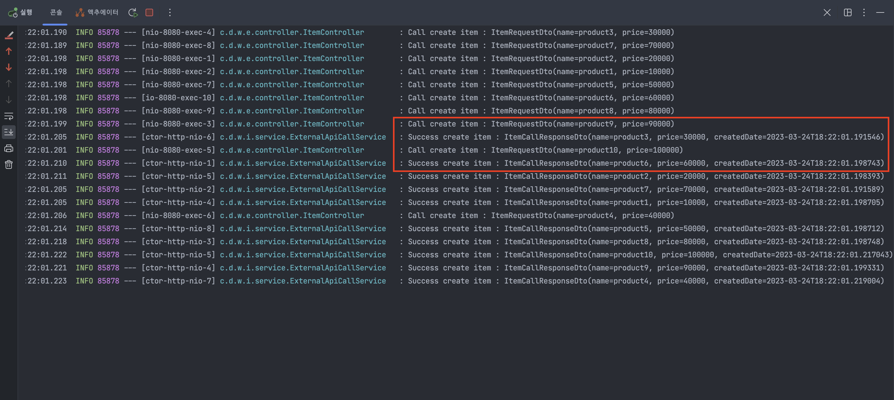

# 스프링 API 비동기 논블로킹 방식 호출 (How to call API with async-nonblocking method)

## RestTemplate To WebClient

### 도입계기

---

<aside>
💡 외부의 대량데이터를 API를 이용하여 내부 DB에 저장해야되는 니즈가 있었다.

</aside>

**[초기 적재에 필요한 시간 비용 측정]**

- 콘텐츠 개수 : 98,250
- 이미지 개수 : 306,654

콘텐츠 목록 조회 : 1번 조회시 최대 100건 (호출 당 5초 정도 소요) → 983(98,250 / 100)번 조회 필요 

- 983(호출수) x 5(초) = 4915초 = 약 82분

콘텐츠 상세 조회 : 98,250번 (호출 당 1초 미만) 

- 98,250(호출수) x 1(초) = 98,250초 = 1,638분 = 약 27시간 = 약 1일 3시간소요

콘텐츠 이미지 조회 : 306,654번 (호출 당 1초 미만)

- 306,654(호출수) x 1(초) = 306,654초 = 5,111분 = 약 86시간 = 약 3일 14시간소요

→ **총 시간 소요 : 5일정도 소요**

> 심지어, 단순 호출만 하는데 걸리는 시간 비용이 5일이라는 것이다.
> 

### 비동기 API 호출 방법이 있을까?

---

나의 사수인? 구글에게 `Spring Async RestTemplate` **의 키워드로 검색을 했다. 

연관 검색어를 통해 `WebClient` 의 존재를 알 수 있었다. 



나랑 비슷한 생각을 가진 사람이 많구나 생각했다. ㅎ

`WebClient` 의  기본 개념을 검색 결과로 익히고 야생형 개발자답게? 바로 예제 코드를 만들었다. (백문이 불여일타.. )

공식문서 링크 다음과 같다..

[링크]

 [https://docs.spring.io/spring-framework/docs/current/reference/html/web-reactive.html#webflux-client](https://docs.spring.io/spring-framework/docs/current/reference/html/web-reactive.html#webflux-client)

### Gradle 설정

---

```groovy
dependencies {
	implementation 'org.springframework.boot:spring-boot-starter-web'
	implementation 'org.springframework.boot:spring-boot-starter-webflux'
	compileOnly 'org.projectlombok:lombok'
	annotationProcessor 'org.projectlombok:lombok'
	testImplementation 'org.springframework.boot:spring-boot-starter-test'
	testImplementation 'io.projectreactor:reactor-test'
}
```

### 테스트 코드

---

테스트를 위해, 외부 API 대체용으로 간단한 컨트롤러 예제를 작성하였다. 

```java
@RestController
public class HelloController {

    @GetMapping("/hello")
    public String hello() {
        return "Hello World";
    }
}
```

만든 컨트롤러를 호출하는 테스트 코드 작성

```java
@AutoConfigureWebClient
@SpringBootTest(webEnvironment = RANDOM_PORT)
class ApiWebClientTest {

    @Autowired
    WebTestClient webTestClient;

    @Test
    void helloWebClient() {
        webTestClient.method(HttpMethod.GET)
                .uri("/hello")
                .exchange()
                .expectStatus().isOk() // 응답 코드 기대값
                .expectBody(String.class) // 응답 body 클래스 타입 기대값 
                .value(response -> { // 응답 바디 response 
                    System.out.println("response = " + response);
                    assertThat(response).isEqualToIgnoringCase("Hello World");
                });
    }
}
```

테스트 성공 화면



### 프로덕션 코드

---

동일한 프로젝트 내에서 패키지 명을 `external`(외부 API 역할 하는 패키지) / `internal` (실제 내부 프로젝트 패키지) 구분하여 코드를 작성할 예정이다. 

먼저, 외부의 API를 만들어 볼것이다. 패키지는 `.external`이다.

<aside>
💡 상품명과 상품가격을 등록하는 가상 API로 결과값은 생성일자가 들어가 반환하는 API다.

</aside>

`ItemController` - 외부 API를 가상한 컨트롤러

```java
@Slf4j
@RestController
@RequestMapping("/external/api/v1/item")
public class ItemController {

    @PostMapping
    public ItemResponseDto create(@RequestBody ItemRequestDto request) {
        log.info("Call create item : {}", request); // 결과값 확인을 위한 로그
        return ItemResponseDto.of(request);
    }
}
```

`ItemRequestDto` - `ItemController`  요청 바디

```java
@Data
public class ItemRequestDto {

    private String name;
    private Integer price;
}
```

`ItemResponseDto` - `ItemController` 응답 바디

```java
@Data
public class ItemResponseDto {

    private String name;
    private Integer price;
    private LocalDateTime createdDate;

    @Builder
    public ItemResponseDto(String name, Integer price) {
        this.name = name;
        this.price = price;
        this.createdDate = LocalDateTime.now();
    }

    public static ItemResponseDto of(ItemRequestDto request) {
        return ItemResponseDto.builder()
                .name(request.getName())
                .price(request.getPrice())
                .build();
    }
}
```

다음은, `.internal.api`에 속하는 패키지로 API를 호출하는데 필요한 코드다. 

`ApiRequestDto<T>` - API 호출하기 위한 DTO 

```java
@Getter
public class ApiRequestDto<T> {

    private final String url; // API 호출 uri  
    private final Object body; // API 요청 바디 
    private final HttpMethod method; // API 요청 메소드

    private final Class<T> returnType; // API 응답 클래스 타입 
    private final Consumer<T> callback; // API 응답 콜백 처리 

    @Builder
    public ApiRequestDto(String url, Object body, HttpMethod method, Class<T> returnType, Consumer<T> callback) {
        this.url = url;
        this.body = body;
        this.method = method;
        this.returnType = returnType;
        this.callback = callback;
    }
}
```

- `Class<T> returnType` : API마다 응답 클래스 타입이 바뀔 수 있으므로 **OCP(개방-폐쇄 원칙)를 원칙**을 준수하여 생성한 변수
- `Consumer<T> callback` : 비동기 API 호출을 하기 때문에 API 응답값을 처리하는 콜백 변수

`ApiWebClient` - `WebClient` : API 호출 클래스 

```java
@Component
public class ApiWebClient {

    private final WebClient webClient;

    public ApiWebClient(WebClient.Builder builder) {
        this.webClient = builder
                .baseUrl("http://localhost:8080") // (1) 외부 API Base URl
                .defaultHeader(CONTENT_TYPE, APPLICATION_JSON.toString()) // (2) DEFAULT HTTP 헤더
                .build();
    }

    public <T> void call(ApiRequestDto<T> request) {
        execute(request).subscribe(request.getCallback()); // (3)
    }

    private <T> Mono<T> execute(ApiRequestDto<T> request) {
        return webClient.method(request.getMethod())
                .uri(request.getUrl())
                .bodyValue(request.getBody())
                .retrieve() // (4)
                .bodyToMono(request.getReturnType()); // (5)
    }
}
```

1. `external` 패키지에 외부 API를 작성하기 때문에 `http://localhost:8080`로 설정 
2. 기본 헤더를 설정 하는 부분이며 `Content-Type : application/json` 를 설정한 부분이다. 

> 1, 2번 필수 사항은 아니고 옵션이다. 만약 API 스펙이 항상 달라진다면 `builder.build()` 로 설정해도 무방하다.
> 

1. `WebClient` API 호출 후 논블로킹 방식(Non-blocking)으로 `request`에 지정한 `callback`처리이다. 
    
    동작 방식은 아래 이미지와 같고 자세한 내용은 참고에 링크를 하였으니 참고 바란다. 
    
    [참고]
    
    [https://projectreactor.io/docs/core/release/api/reactor/core/publisher/Mono.html#subscribe-java.util.function.Consumer-](https://projectreactor.io/docs/core/release/api/reactor/core/publisher/Mono.html#subscribe-java.util.function.Consumer-)
    



1. 응답을 추출하는데 사용하는 메소드이다. 
    
    비슷한 메소드로 많은 제어가 필요할 때 사용하는 `exchangeToMono()`, `exchangeToFlux()`가 있지만, 메모리 누수의 가능성이 있어 `retrieve()`를 권장한다. 
    
    [참고]
    
    [https://docs.spring.io/spring-framework/docs/current/reference/html/web-reactive.html#webflux-client-retrieve](https://docs.spring.io/spring-framework/docs/current/reference/html/web-reactive.html#webflux-client-retrieve)
    
2. 응답 바디만 `return`하며 **클래스 타입**은 `request`에 지정한 `returnType`으로 설정한다. 

마지막으로, 외부 가상 API를 호출하기 위한 코드이다.

`ExternalApiCallController` - 외부 API호출 하는 컨트롤러

```java
@RestController
@RequiredArgsConstructor
@RequestMapping("/external/api/call")
public class ExternalApiCallController {

    private final ExternalApiCallService callService;

    @GetMapping("/create-item/count/{count}") // {count}는 비동기로 호출할 개수를 말한다.
    public String createItemOne(@PathVariable int count) {
        callService.execute(count);
        return "OK";
    }
}
```

`ExternalApiCallService` - 외부 API호출의 서비스 클래스

```java
@Slf4j
@Service
@RequiredArgsConstructor
public class ExternalApiCallService {

    private final ApiWebClient webClient;

    public void execute(int count) {
        validate(count); // count 검증

        getTargets(count).boxed()
                .map(this::createRequest) // API 호출에 사용할 요청 dto 세팅
                .forEach(webClient::call); // API 호출
    }

    private void validate(int count) {
        if (count < 1) throw new IllegalArgumentException("Greater than 1");
    }

    private ApiRequestDto<ItemCallResponseDto> createRequest(Integer index) {
        return ApiRequestDto.<ItemCallResponseDto>builder()
                .returnType(ItemCallResponseDto.class) // 응답 바디 타입 지정 
                .url("/external/api/v1/item") // 외부 가상 API URL 
                .method(POST) // 외부 가상 API 메소드 
                .body(createBody(index)) // 요청 바디 생성 
                .callback(this::callback)
                .build();
    }

    private void callback(ItemCallResponseDto response) {
        log.info("Success create item : {}", response); // 결과값 확인 위해 로그 
    }

    private ItemCallRequestDto createBody(Integer index) { // 요청 바디 생성
        return ItemCallRequestDto.builder()
                .name("product" + index)
                .price(index * 10000)
                .build();
    }

    private IntStream getTargets(int count) {
        return IntStream.range(1, count + 1); // 1부터 파라미터로 들어온 count만큼 API 호출 하는 프로세스 
    }
}
```

`Dto`는 위에서 외부 API와 거의 비슷하게 생성하였다. 

`ItemCallRequestDto` - 외부 API 요청 바디 

```java
public class ItemCallRequestDto {

    private String name;
    private Integer price;
}
```

`ItemCallResponseDto` - 외부 API 응답 바디 

```java
@Data
public class ItemCallResponseDto {

    private String name;
    private Integer price;
    private LocalDateTime createdDate;
}
```

그럼, 이제 **프로덕션** 코드는 다 작성했으니 결과를 확인해보자.

### 프로덕션 코드 결과

---

일단 한번만 호출하게 테스트 해보자. (호출은 IntelliJ에서 제공하는 `http`로 진행하였다.)

```
GET http://localhost:8080/external/api/call/create-item/count/1
```



응답은 정상적이다. 그럼 결과값 확인을 위해 로그 처리를 해놨던 부분이 찍혔는지 확인해보자. 🤣 



오.. `callback` 처리도 정상적으로 된 것을 확인 할 수 있다.

그러면 우리가 궁극적으로 하고자 했던 비동기 - 논블로킹방식으로 여러개의 API를 호출해보자 

10번을 호출하는 엔드 포인트이다. 

```
GET http://localhost:8080/external/api/call/create-item/count/10 
```

응답은 정상적이다. 그럼 마찬가지로 로그 확인.. 



로그를 보면 뒤죽박죽이다. ㅋㅋ 

결과부터 말하면 원하던 로그의 그림이다. 

- `빨간색 박스` 부분을 보면 호출로그인 **“Call create item”** 사이의 콜백 로그인 **“Success create item”** 이 찍혀있는걸 보니 비동기 호출이 정상적으로 되어있음 알 수 있다.
- 그리고, 콜백로그의 `ItemCallResponseDto`의 `craeteDate`의 시간을 보면 거의 동시에 호출 되었음을 알 수 있다.

그럼 이제 실제 서비스에 적용을 해보도록 하자. 코드는 업무관련된거라 오픈이 불가능하고 결과를 공유 하겠다. 😄

### 실제 업무 서비스에서의 `WebClient` 도입 결과

---

콘텐츠 목록 조회 : 10개 비동기 호출 1번 조회시 최대 1000건 (호출 당 5초 정도 소요) → 99(98,250 / 1000)번 조회 필요 

- 99(호출수) x 5(초) = 495초 = 약 9분

콘텐츠 상세 조회 : 100개 비동기 호출 → 983(98,250 / 100)번 (호출 당 1초 미만) 

- 983(호출수) x 1(초) = 983초 = 17분 소요

콘텐츠 이미지 조회 : 100개 비동기 호출 → 3,067(306,654 / 100)번 (호출 당 1초 미만)

- 3,067(호출수) x 1(초) = 3,067초 = 52분 소요

→ **총 시간 소요 : 1시간 18분**

<aside>
🤩 시간상,  **도입 전 5일**에서 **도입 후 1시간 18분**으로 단축하였다…

</aside>

음.. 퍼포먼스가 약 92%증가 하였다. 

앞으로도 대용량으로 데이터 이관할때 API를 사용한다면,, 

기존의 많이 사용했던 `RestTemplate`보다 `WebClient`를 사용할 것 같다. 

코드는 Github에 올릴 예정이라 참고 바란다.

Github Repository :  https://github.com/discphy/webclient-example