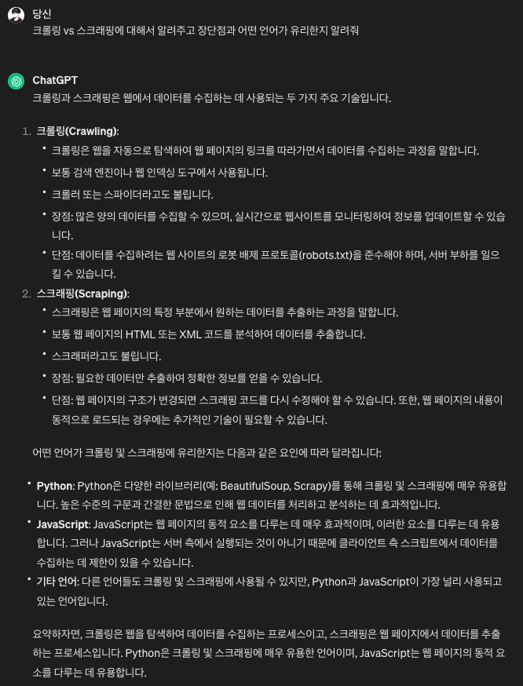
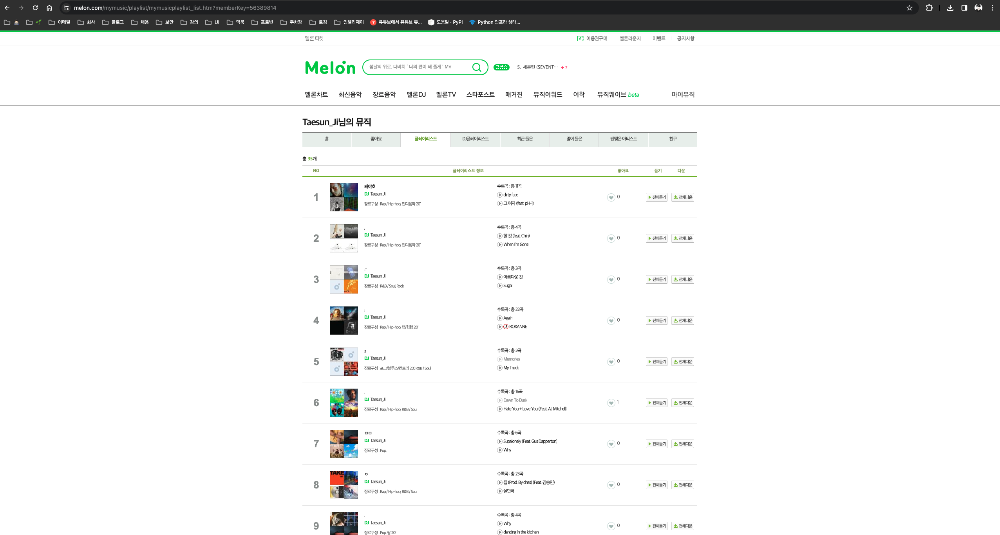
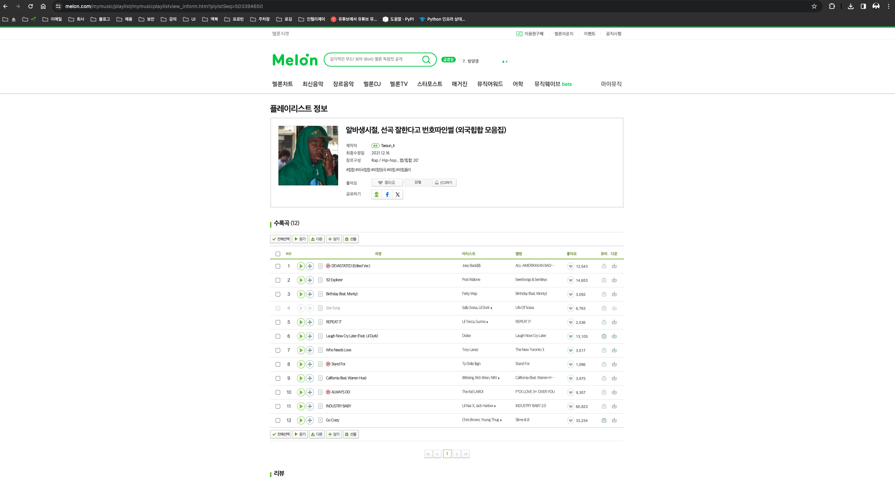
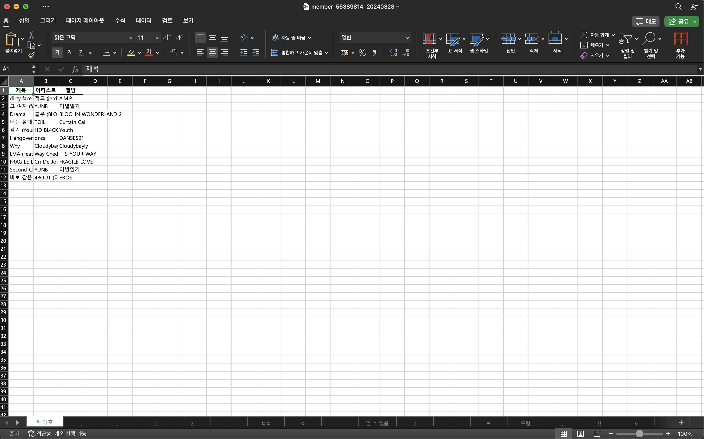
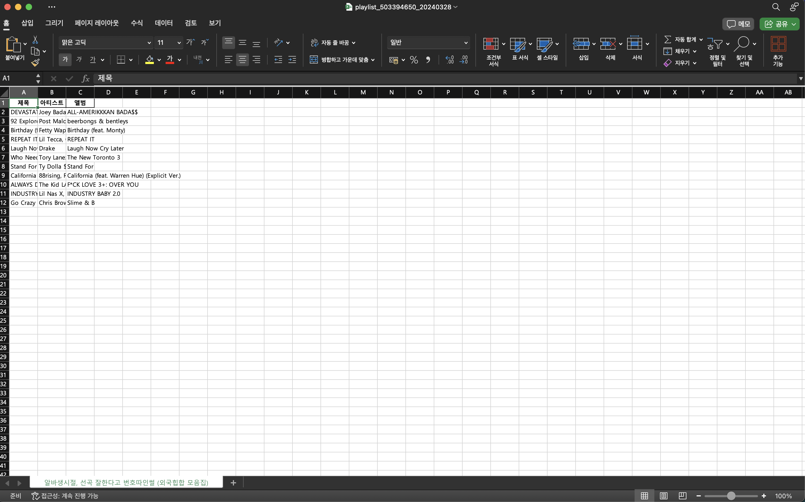
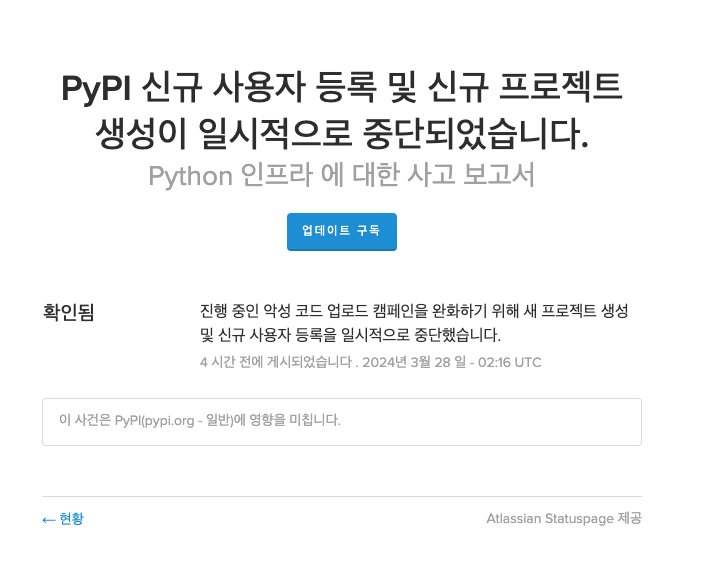

# 파이썬 웹 스크래핑 - 멜론 음원 추출

시작하기에 앞서, 파이썬을 최근에 공부하면서 스크래핑이라는 단어를 처음 들었다. 
크롤링은 들어봤는데.. 스크래핑은 무엇인가..? 



프로젝트를 진행하면서, 크롤링 업무를 맡은 적이 꽤 있는데 내가 했던 건 대부분 스크래핑이었던 것 같다..
그리고, 스크래핑의 유리한 언어가 파이썬이라고 해서 이렇게 글을 작성하게(?) 되었다. 

## 프로젝트 선정 과정

---

유튜브 프리미엄을 유료 구독을 하게되면 유튜브 뮤직을 무료로 이용할 수 있다. 이미 멜론 스트리밍 서비스를 유료로 사용하고 있던 나에게 고민이 찾아왔다… 
약 2016년부터 7~8년간 3,000곡의 플레이리스트가 멜론에 저장되어있다. 

위의 플레이리스트를 오차 없이 유튜브 뮤직으로 옮기게 된다면…
많은 이점(절약? 동기화? 등)이 있을 것 같아 멜론의 음원들을 유튜브 뮤직으로 이관하는 프로젝트를 작성하기로 결심하였다. 

## 프로젝트 요구 사항

---

- [ ]  나의 멜론 계정에 포함되어있는 플레이리스트 추출 기능
- [ ]  추출한 플레이리스트의 음원 추출 기능
- [ ]  추출한 플레이리스트와 음원에 대한 정보를 엑셀 파일 작성 및 저장 기능
- [ ]  작성한 엑셀의 음원을 유튜브 재생목록에 저장

> 유튜브의 경우, 한계가 있어 구현하지 못하였다… 자세한 내용은 밑에서 설명하겠다.. 다음 편에 계속(!?)
> 

## 멜론의 웹 구조 탐색

---

1. 플레이리스트 조회 페이지 URL : [https://www.melon.com/mymusic/playlist/mymusicplaylist_list.htm?memberKey=56389814](https://www.melon.com/mymusic/playlist/mymusicplaylist_list.htm?memberKey=56389814)
    - [https://www.melon.com/mymusic/playlist/mymusicplaylist_list.htm](https://www.melon.com/mymusic/playlist/mymusicplaylist_list.htm) 의 쿼리 파라미터로 `memberKey`를 받는다.
    - 멜론 유저의 프로필을 공유 받아 `memberKey`의 값을 얻는다.
        
        
        

1. 플레이리스트의 포함된 음원 조회 페이지 URL : [https://www.melon.com/mymusic/playlist/mymusicplaylistview_inform.htm?plylstSeq=533264243](https://www.melon.com/mymusic/playlist/mymusicplaylistview_inform.htm?plylstSeq=533264243)
    - [https://www.melon.com/mymusic/playlist/mymusicplaylistview_inform.htm](https://www.melon.com/mymusic/playlist/mymusicplaylistview_inform.htm?plylstSeq=533264243) 의 쿼리 파라미터로 `plystSeq`를 받는다.
    - 위의 페이지에서 각 플레이리스트를 클릭하면 `plystSeq`의 값을 얻을 수 있다.
        
        
        

1. 플레이리스트 조회  / 플레이리스트의 포함된 음원 조회 각각의 한 페이지당 노출 되는 아이템 개수 
    - 플레이리스트 조회 : 한 페이지 당 총 20개
    - 플레이리스트의 포함된 음원 조회 : 한 페이지 당 총 50개

1. 플레이리스트 조회  / 플레이리스트의 포함된 음원 조회 페이지 이동
    - 페이지 버튼에 붙어있는 실행 함수 : `javascript:pageObj.sendPage(offset)`으로 페이지 이동을 한다.
    

> 일반적인 페이지의 경우 쿼리 파라미터로 `page`와 `offset`의 쿼리 파라미터로 구성되어 있어 패턴 예측이 쉬우나, 멜론의 경우 패턴을 유추 할 수 없어 스크립트를 사용해야 한다.
> 

## 프로그램 구현 - `melon.py`

---

[주요 패키지]

- `webdriver` : 웹 브라우저의 이동 / 스크립트 실행 / 요소 찾는 기능
- `BeautifulSoup` : HTML 정보 수집
- `pandas` : 수집한 데이터 처리 및 조작

[상수]

```python
# 상수 정의
WAIT_TIME = 1 # 웹 드라이버 대기 시간 
TODAY_DATE = datetime.today().strftime('%Y%m%d') # 엑셀 파일 이름에 들어가는 오늘 날짜 
MUSIC_COLUMNS = ['제목', '아티스트', '앨범'] # 엑셀 헤더 컬럼 
PLAYLIST_URL = 'https://www.melon.com/mymusic/playlist/mymusicplaylist_list.htm' # 플레이리스트 URL
MUSIC_URL = 'https://www.melon.com/mymusic/playlist/mymusicplaylistview_inform.htm' # 음원 URL 
EXCEL_PATH = "../excel" # 엑셀 파일 경로
```

[함수형 프로그래밍 구현]

- 메인
    - 회원 전체 플레이리스트 스크래핑
        
        ```python
        # 회원 키로 전체 플레이리스트 음악 가져오기
        def member(member_key):
            driver = init() # 웹 드라이버 세팅
        
            driver.get(PLAYLIST_URL + '?memberKey=' + member_key) # 플레이리스트 조회 페이지 이동 
            playlist_total_count = int(driver.find_element(By.CSS_SELECTOR, '.no').text) # 페이지 이동에 필요한 "총35개"의 요소의 "35" 즉 숫자 값을 가져온다. 
        
            playlist_seqs = get_playlist_seqs(driver, playlist_total_count) # 전체 플레이리스트 plystSeq 값을 가져온다. 
            data_frame_list = scrape_music_data(driver, playlist_seqs) # 음원 정보 추출
        
            write_excel(data_frame_list, 'member_' + member_key + '_' + TODAY_DATE + '.xlsx') # 엑셀 작성
        
            driver.quit()
        ```
        
    - 단일 플레이리스트 스크래핑
        
        ```python
        # 플레이리스트 키로 음악 가져오기
        def playlist(playlist_key):
            driver = init()
        
            playlist_seqs = [playlist_key] # 단일 플레이리스트 
            data_frame_list = scrape_music_data(driver, playlist_seqs) # 음원 정보 추출
        
            write_excel(data_frame_list, 'playlist_' + playlist_key + '_' + TODAY_DATE + '.xlsx') # 엑셀 작성
        
            driver.quit() 
        ```
        
- 웹 드라이버 세팅
    
    ```python
    # Selenium 드라이버 세팅
    def init():
        chrome_options = Options()
        chrome_options.add_argument("--headless") # Chrome 브라우저 백그라운드 실행 옵션 : 속도 개선 
        driver = webdriver.Chrome(options=chrome_options)
    
        return driver
    ```
    

- 플레이리스트 키 가져오기
    
    ```python
    # 플레이리스트 키 가져오기
    def get_playlist_seqs(driver, playlist_total_count):
        playlist_seqs = []
        for offset in range(1, playlist_total_count + 1, 20): # 20씩 페이지 수 만큼 반복
            driver.execute_script("javascript:pageObj.sendPage('" + str(offset) + "')") # 페이지 이동 스크립트 호출 
            time.sleep(WAIT_TIME)
    
            playlist_links = driver.find_elements(By.CSS_SELECTOR, 'dt a') # 플레이리스트 상세 페이지 이동 url 가져오기 
            for link in playlist_links:
                playlist_seq = re.findall(r'\d+', link.get_attribute('href'))[1] # URL에서 plystSeq 값만 추출 
                playlist_seqs.append(playlist_seq) # 배열에 저장
    
        return playlist_seqs
    ```
    
- 음원 데이터 셋 추출
    
    ```python
    # 음악 스크래퍼
    def scrape_music_data(driver, playlist_seqs):
        data_frame_list = []
        for playlist_seq in playlist_seqs:
            driver.get(MUSIC_URL + '?plylstSeq=' + playlist_seq) # plystSeq로 음원 조회 페이지 이동 
            time.sleep(WAIT_TIME)
    
            playlist_title = driver.find_element(By.CSS_SELECTOR, '.more_txt_title').text # 플레이리스트 타이틀 요소 가져오기 (엑셀 시트 명)
            music_total = int(re.search(r'\d+', driver.find_element(By.CSS_SELECTOR, '.title .cnt').text).group()) # 페이지 이동 위한 "수록곡(12)"의 "12"를 추출 
    
            music_data = []
    
            for offset in range(1, music_total, 50): # 50씩 페이지 수 만큼 반복
                driver.execute_script("javascript:pageObj.sendPage('" + str(offset) + "')") # 페이지 이동 스크립트 호출 
                time.sleep(WAIT_TIME)
    
                soup = BeautifulSoup(driver.page_source, 'lxml') # HTML 파싱 위한 BeautifulSoup 전환
                tr_tags = soup.find_all('tr')
    
                for tr in tr_tags:
                    td_tags = tr.find_all('td', class_='t_left') 
                    if td_tags and td_tags[0].find(class_='fc_gray'):
                        title = td_tags[0].find(class_='fc_gray').text.strip() # 음원의 제목 추출
                        artist = td_tags[1].find(id='artistName').text.strip() # 음원의 아티스트명 추출
                        album = td_tags[2].find(class_='fc_mgray').text.strip() # 음원의 앨범명 추출
                        print("Title : ", title, " / ", "Artist : ", artist, " / ", "Album : ", album) # 추출한 데이터 출력
                        music_data.append([title, artist, album])
    
            df = pd.DataFrame(music_data, columns=MUSIC_COLUMNS) # pandas 데이터 처리
            data_frame_list.append({'sheet': playlist_title, 'data': df}) 
    
        return data_frame_list
    ```
    
- 엑셀 작성
    
    ```python
    # 엑셀 쓰기
    def write_excel(data_frame_list, filename):
        if not os.path.exists(EXCEL_PATH): 
            os.makedirs(EXCEL_PATH) # excel 디렉토리 생성
    
        with pd.ExcelWriter("excel/" + filename) as writer:
            for data_frame in data_frame_list:
                sheet_name = data_frame.get('sheet') # 시트 명 가져오기 
    
                m = re.compile(r'[\\*?:/\[\]]').search(sheet_name) # 허용되지 않는 시트 명 검사
                if m:
                    sheet_name = '알 수 없음'
    
                data_frame.get('data').to_excel(excel_writer=writer, sheet_name=sheet_name, index=False) # 엑셀 파일 작성
    ```
    

## 테스트

---

[회원 전체 플레이리스트 스크래핑]

- 실행 파일 - `member.py`
    
    ```python
    from melon import member
    
    # https://www.melon.com/mymusic/playlist/mymusicplaylist_list.htm?memberKey=56389814
    member('56389814')
    ```
    
- 실행 스크립트
    
    ```bash
    python ./member.py
    ```
    
- 결과 엑셀 파일
    
    
    

> 플레이리스트 별로 시트가 생성된 것을 확인할 수 있다.
> 

[단일 플레이리스트 스크래핑]

- 실행 파일 - `playlist.py`

```python
from melon import playlist

# https://www.melon.com/mymusic/playlist/mymusicplaylistview_inform.htm?plylstSeq=503394650
playlist('503394650')
```

- 실행 스크립트

```bash
python ./playlist.py
```

- 결과 엑셀 파일
    
    
    

> 이렇게 간단하게 웹 스크래핑을 할 수 있는 코드를 작성해봤다. 
만약 `Java`로 작성 했으면 더 복잡한 코드이지 않았을까...?라는 생각을 해본다.
> 

## 유튜브 한계

---

원래 프로젝트의 요구사항에는 유튜브 뮤직으로 스크래핑으로 추출한 음원을 이관을 해야되는 작업이 있지만 아래의 여러가지 이유로 잠깐 보류(?) 하겠다. 

1. 유튜브 페이지의 스크래핑의 한계 : HTML 생명주기가 불특정하며, 정확한 음원을 검색하는 데에 있어 어려움이 있다.
    
    > 유튜브의 정식 음원을 찾을려면 **keyword**를 ([제목] [아티스트명] [앨범명] ****topic)이라고 명시 하면 정식음원이 상단에 노출된다. → 항상 그렇지는 않다. 음원도 별로 없고…
    > 
2. 유튜브 API를 통해 검색 및 재생목록 생성 / 음원 추가 등을 구현하려고 할 때, 하루의 최대 200곡만 재생목록에 저장 할 수 있는 API 제한 때문에 한계가 있다. 

> 이러한 한계 때문에 다른 아이디어를 고안 중에 있다...
> 

## 프로젝트 배포

---

해당 프로젝트를 패키지 화하여 [Pypi](https://pypi.org/)에 배포 하려고 했으나 아래 이미지 처럼 현재는 불가하다. 
다음에 알아보도록 하자…. 



## 보완

---

파이썬 프로그램을 처음 작성하다보니, 자주 사용하던 `Java`에 비해 여러가지의 어려움(자동완성? 타입? 문법 등)이 있었으나 뛰어난 생산성에 놀라웠다.
앞으로 AI 시대에 맞게 파이썬의 매력을 더 느끼기 위하여 꾸준히 학습할 예정이다.

위의 프로젝트는 함수형 프로그래밍으로 작성하였다. 파이썬도 `OOP` 객체지향 프로그래밍으로 위의 코드를 리팩토링을 해 볼 생각이다.
또 현재는 불가하지만, 프로젝트 배포도 한번 경험을 해보고 싶다.

차후에 기회가 되면 🤣, 유튜브 음원 이관까지하여 원래 프로젝트의 요구사항에 맞는 프로그램을 작성 해야되지 않을 까 싶다.. 

위의 소스는 깃허브에 별도로 첨부 합니다. 필요하신 분은.. 가져다 쓰셔도 됩니다.. 🙃

[https://github.com/discphy/melon-scrap](https://github.com/discphy/melon-scrap)

끝!