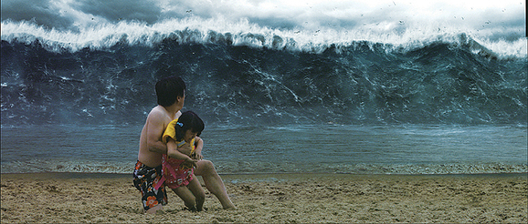

# 2022년 회고

개발자로 일하면서 회고를 처음 끄적여본다…

어떻게 써야할지 막막하지만 하루빨리 쓰지 않으면 2023년 회고?를 써야 할 날이 올 것 같아 

퇴근 후 샤워를 마치고 23시에 부랴부랴 바로 맥북을 열어서 써본다.

### 2022년 실직자의 서막

---

2021년 12월에 H사에서 1년만에 퇴직을하고 2022년을 바로 맞이하게 되었다.

내가 느끼기에는 자진퇴사가 아닌 권고사직의 느낌을 받으며 퇴사를 했던 걸로 기억한다. 

2021년으로 거슬러 올라가?(2022년 회고지만 거슬러 올라가 보겠다..🤣) H사 입사 한날 대략 11월쯤이였다. 

이전부터 같은회사에 있었던 적은 없지만 사수이자 멘토인 팀장님께서 이직을 준비하던 나에게 기가막힌 촉으로 입사제안을 주셨다. 

이직의 벽을 느끼고 있을 때쯤 제안을 주신거라 눈이 낮아지기도 했고.. 좋은 조건에 바로 OK를 했다. 

그렇게 입사를 하고 난 뒤.. 하기로 했던 신규 고도화 프로젝트는 사라지고 말았다. 

요약하면, **스프링을** 극도로 싫어하셨던 팀장님(당시 회사에서는 직책은 부서장)은 본인께서 만드신 프레임워크로 신규 프로젝트 사업을 진행하기 원하셨고, 

다른 부서장님들은 당연하게 반대하여, 프로젝트가 깨진 것이다. 

정확하지는 않지만 팀장님께서 **가독성이 떨어진다**는 이유로 스프링을 싫어 하셨다.

> 지금 생각해보면 이해하기 조금 쉽지않다.. 😅
> 

그렇게 정치 싸움에 밀려나기 시작했고, 새로운 개발 세력들이 들어와 많은 개발 문화를 변화 및 도입(맥북 구매, 인텔리제이 구매, `GitLab`, `Jira`, `Confluence` 도입  등)하였고 

기존 개발자들은 급격한 변화에 적응을 못하고 퇴사자로 몰락하였다. 내 개인적인 생각으로는 많은 퇴사자의 가장 큰 이유는 자사 서비스가 코로나 시국의 타격이 큰 여행사 였기 때문이라고 생각된다. 

당시 상황을 비유하자면,, 

그렇게 1년뒤 나 또한 퇴사를 맞이하게 되었다. 

중간에 다른 팀에서 이적제안이 들어오긴 했지만, 당시엔 팀장님과의 의리?를 져버릴 순 없었다…. 

(개발 문화가 고팠던 나였어서.. 개인적으로는 조금 아쉬운 기회라고 생각한다. 실제로도 고민을 조금 했을 정도니.. )

### 팀장님의 부재

---

2022년을 실직자로 맞이한 나는 쉬지 않고 팀장님과, 나와 같이 퇴사한 팀원과 같이 3명이서 외부 프로젝트를 진행하였다. 

이 시기는 26년 인생 동안 제일 아깝고 후회되는 시간이라고 자신있게? 말할 수 있다. 

물론 이직을 할 수도 있는 상황이였지만 팀장님께서 빅테크 기업들을 컨택 중이라고 하셨으며, 

최대 2개월 이내에는 입사가 가능하다고 말에 나는 목빠지게 기다릴 수 밖에 없었다. 

위에서 언급한 문장(**제일 아깝고 후회되는시간**)으로 짐작할 수 있겠지만 2개월이 지나고, 시간은 계속 흘러가.. 5월까지 지속되었다. 

업무환경은 스터디 카페나 일반 카페가 대부분이였다..

급여 또한 계속 밀렸다. 외부 프로젝트를 진행하긴 했지만 5개월동안 쉬지않고 일 하면서 2개월의 월급도 못받았다. 

빅테크 기업과의 지속적인 그리고 장기적인 컨택 중이라는 팀장님의 계속되는 사탕발린 말에 난 의심이 점차 들 때쯤.. 5월 말.. 팀장님이 사라졌다.. 자세한 얘기는 생략하겠다. 

작업한 오픈 못한 외부 프로젝트도 다 멈춰버렸다. 

동시에 나의 멘탈도 같이 멈춰버렸다. 

하지만, 멘탈을 다시 부여잡을 틈도 없이, 기존에 오픈한 서비스를 인수인계 없이 기억에만 의지하여 운영을 해야만 했다. 

모든걸 엎어버리고 싶었지만, 서비스를 엎을 수는 없어 꾹 참았다… 

다행히도, 몇번의 장애(SSL 인증서 만료, CDN 이슈 등)들이 있었지만 현재까지는 잘? 운영 중이다. 

### 자아성찰

---

1년 반만에 난 또 이직을 준비해야만 했다. 남아있는 기대감 탓이였는지..  터무니 없는 이력서와 경험을 가지고 높은 기업들을 쳐다보았다. 

당시에 작성했던 이력서의 기술태그

위의 이미지를 보면 알겠지만 한번 찍먹? 해본 것들은 전부 기재하였다. 

개발을 잘 모르는 인사팀에서도 이런 이력서를 보면 기겁을 했을 것이다. 

결과는.. 입만 아니 손만 아프다.

> 지금 보니.. 너무 민망할 정도다..
> 

다시 처음부터라는 생각으로 **“개발자 이력서”**라는 키워드로 유튜브를 검색 해보았다. 

높은 조회수에 꽤나 흥미로웠던 썸네일은 나의 트랙패드를 움직이게 하였다. 

내가 이끌렸던 동영상

위의 동영상을 시작으로 관련된 워키토키 컨텐츠의 영상을 전부다 시청하였으며, 나오신 출연진(베테랑 개발자)분들의 이력서를 보게 되었다. 

그 중 가장 눈에 띄는 이력서는 [향로](https://jojoldu.tistory.com/)님이였다. 눈에 띄기 보다도 내가 그냥 **우아한 형제들**을 좋아해서 그런 거 일지도 모른다.. ㅎ

이후로, 향로님에 대한 집착이 시작되었다. 

- [블로그](https://jojoldu.tistory.com/)
    
    이미 너무나도 유명한 블로그였다. 내가 본 게시글 중 가장 도움이 됐던 글은 옛날에 작성하신 글이긴 하지만 **[스프링부트로 웹 서비스 출시하기](https://jojoldu.tistory.com/250)** 였다. 스프링의 기본기가 부족하여 글을 보며 코드를 작성했었는데 실제로 도움이 많이 되었다. 
    
- [유튜브](https://www.youtube.com/@devbadak)
    
    호돌맨님과 같이 운영 중이신 개발바닥이라는 채널이다. 구독자이며 현재까지 즐겨보고 있다. 가장 좋아하는 컨텐츠는 **개발자 초대석**이다. 
    
- [서비스](https://www.inflearn.com/)
    
    개발바닥 유튜브의 영한님 초대석 동영상을 시청한 후 알게되어 영한님의 전강의를 구매하여 인프런 매출에 일조하였다. 
    

위의 3가지의 채널들은 전부 이 당시에 처음 접한 채널들이다. 

향로님에 대한 나의 집착은 상당히 성공적이였다. 

왜냐하면, 개발자로써의 내 자신을 리뉴얼 하기 시작하게된 계기가 되었기 때문이다. 

리뉴얼 항목

- [깃허브 재개설](https://github.com/discphy)
- [노션 이력서 작성](https://www.notion.so/Resume-bf63c898977645d185c95f9cef2b2a0b)
- [인프런 강의 수강](https://www.notion.so/Studying-8de1f3927da94471a9e538567361f92d)

깃허브는 1일 1커밋을 목표로 현재진행형 중이다. 인프런 강의도 꾸준히 수강 중이다. 위의 리뉴얼로 인하여 객관적으로 다시 나를 돌아봤을 때 많이 성장했다고 생각한다. 그 중에서도 `스프링 부트`에 대한 이해도가 많이 높아졌다. 이전에는 `스프링 부트`를 업무에서 경험도 못해봤고 개인 스터디도 안했었는데.. 지금은 업무에서도 사용하다보니 익숙해졌다. 

### 프리랜서

---

자아성찰도 중요하지만, 당장 수입이 없었던 나는 구직활동을 해야했다.

6월쯤, 구직활동하고 있을 당시였다. H사에서 인연이 된 상사님들과 술자리가 생겼다. 

이런저런 얘기를 하다보니.. 같은 팀으로 계셨던 과장님께서 같이 일해보자고 제안을 주셨다. 

그 제안은 **프리랜서** 제안이였다. 

내가 알고있는 개발 프리랜서는 업무에만 쫒기고 성장하는데에 도움이 잘 안될 것 같다는 편견을 같고 있었다. 그렇지만 경험을 해보고 편견을 지우고자 그 제안을 덥석 물었다.

빠른 합류를 원하셨던 과장님의 말씀에 나는 바로 다음 달에 출근을 하게 되었다. 프로젝트의 타이틀은 고도화였고 검색엔진 및 인터페이스 담당을 맡게되었다. 오랜만에 일을 해서 그런지 너무 재미있었다. 고도화 프로젝트는 10월달에 탈없이 오픈하였고, 현재는 리뉴얼 프로젝트에 백엔드 연계 담당으로 업무를 하고있다. 

### 2023년 계획

---

다사다난하기도 신선하기도 했던 2022년을 뒤로 하고 2023년 계획을 세워보고자 한다. 

- 사이드 프로젝트

나는 매주 토요일마다 조기축구?를 7년째 하고있다. 우리팀 팀원들은 대부분 대학교의 같은 과들로 개발자 출신들이 꽤나 존재했다. 7년동안 총무 및 임원으로 팀을 운영하면서 노하우도 생겼지만 불편한 요소들이 있다. 

1. 출석체크 
2. 상대팀 매칭

작년에 사이드 프로젝트의 중요성을 느껴 팀원들 중 같이 진행할 인원을 모집했다. 그렇게 팀이 구성되었으며 지금은 설계 및 기획을 진행하고있다. 초기 오픈일자는 4월이고, 초기 스펙은 출석체크 기능이 주를 이룰 것이다. 오픈 이후 상대팀 매칭 서비스 기능을 업데이트 할것이다. 서비스는 상용화를 위해 앱 서비스를 할 예정이다. 

- 프리랜서 계속하는게 맞을까?

물론 현재 업무하는 것도 나쁘지 않다. 내가 인복이 좋은지?는 모르겠지만 지금 진행하고 있는 프로젝트는 내가 속해있는 6명의 프리랜서 팀이 개발 쪽을 담당으로 하고있는데 팀원들이 너무 좋으신 분들이다. 물론 합도 좋아 업무 치는 속도가 상당하다. 

그렇지만 내가 SI업무만 거의 진행하다 보니.. 살짝 물리기? 시작했다. 프리랜서 특성상 대부분 SI 프로젝트만 하기도 하고, 아래한글을 사용한 인수인계 문서 작성, 정해진 개발 기술 스택 등 틀을 좀 깨고 싶어졌다. 

모든 개발자들 처럼 나도 소히 말하는 네카라쿠배 가는 것이 내가 가지고 있는 최종 목표이긴하다. 그 뒤의 로드맵도 있긴하지만, 그래서 자사서비스하는 곳을 가서 개발 문화를 접해보고 싶고, 쓰고 싶은 기술 스택도 있고 가장 큰 이유로는 트래픽을 한번 받아보고 싶다.. 그래서 기회가 된다면 개인 성장에 비중을 높여 금년안에 자사서비스를 하는 회사로 이직을 하고싶다. 개인적인 바램이다.

이렇게 처음으로 1년에 대한 회고록을 처음 써보는데 아직 글을 쓰는게 어색하긴 하다…

그렇지만 지난해를 돌아보고 다음 해에 대한 목표를 정하니, 나의 성장도 파악을 할 수있고 목표를 꼭 지켜야하는 사명감? 같은게 생기는 것 같아 앞으로도 매년 회고록을 작성할 예정이다.