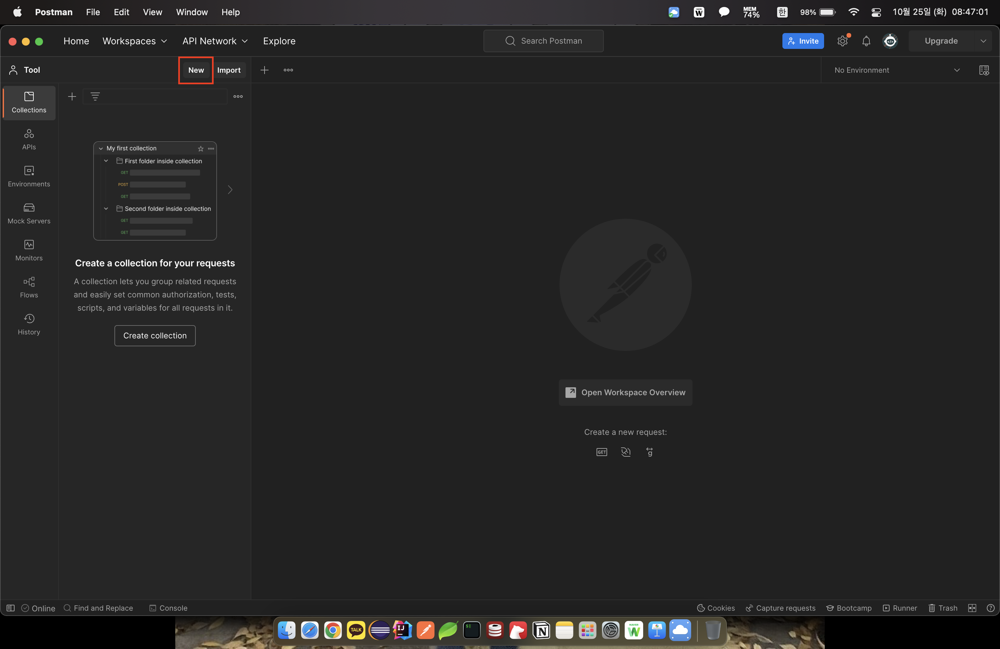
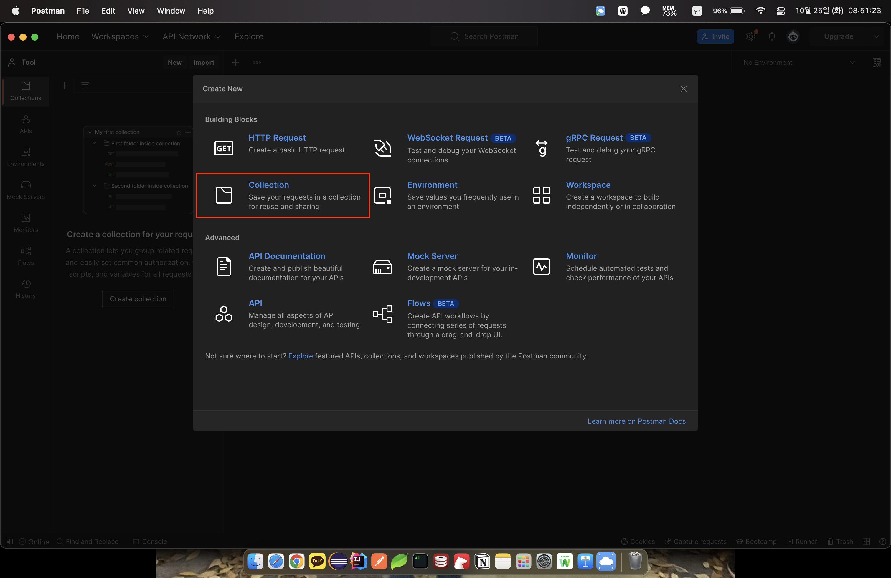
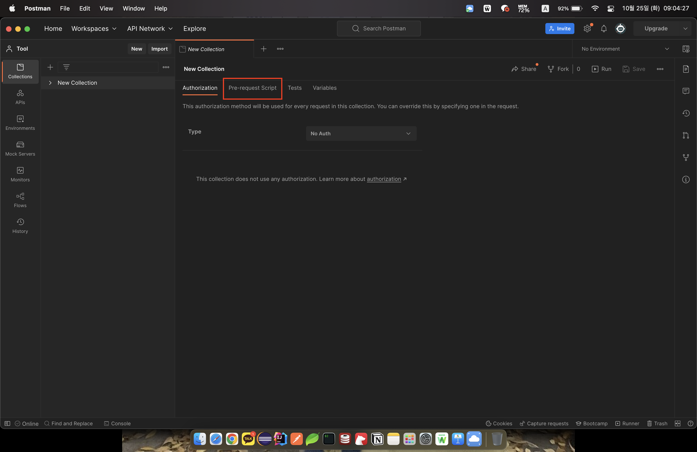
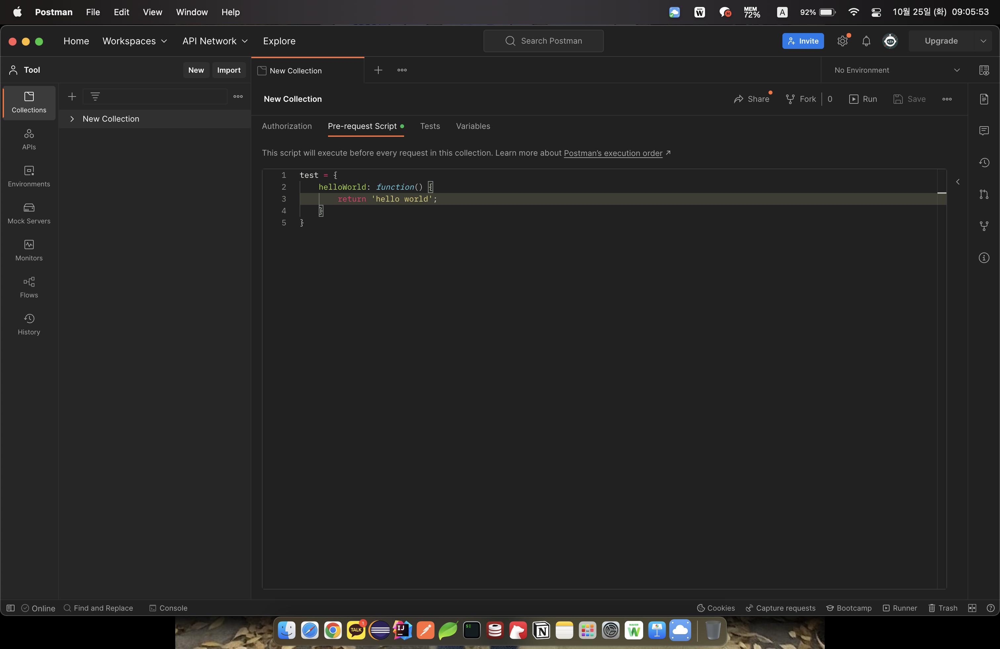
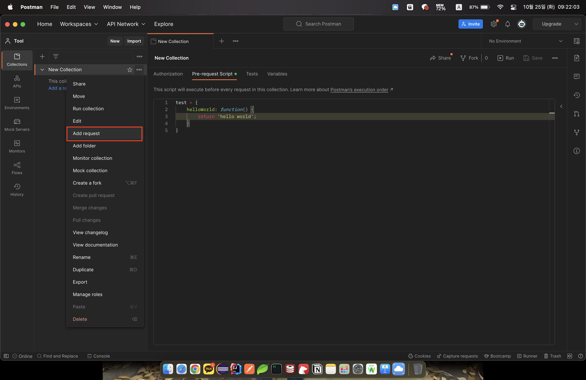
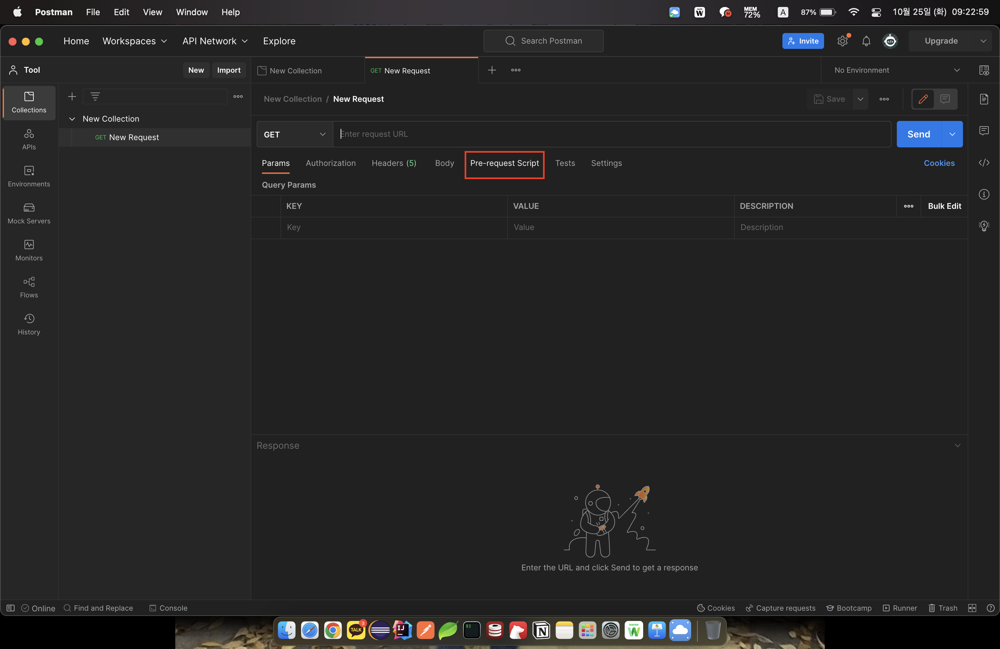
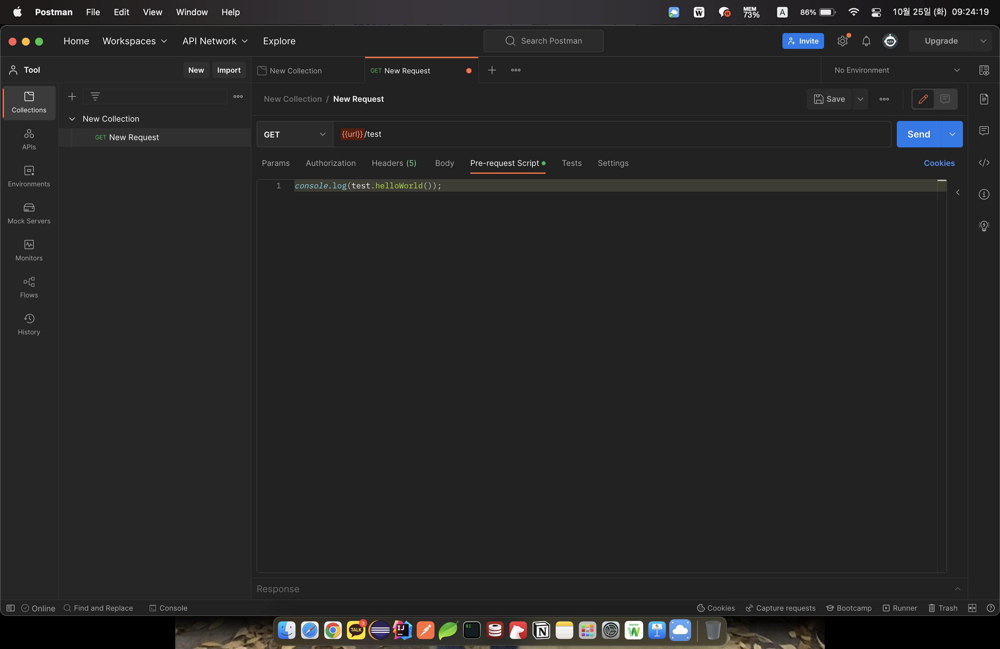
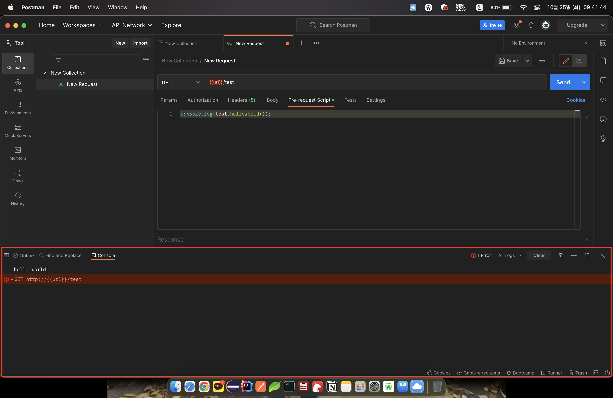

# Postman 글로벌 함수 

`Postman`을 사용 하다가..

여러  `HTTP request` 의  `Pre-request Script`에서 공통적으로 호출하는 **함수**가 필요해(반복이 제일 싫다.. 🤣) 내용을 찾아보다 좋은 방법을 발견하여 간단하게 공유합니다!! 

> `Pre-request Script` :  `HTTP`호출 전 실행 할 스크립트를 이야기 한다. 

1. `New` 버튼을 클릭하여 `Collection` 생성 

2. 아래와 같이 `Pre-request Script` 클릭후 공통으로 사용할 함수를 정의 한다. 

> 함수를 정의할 때 `var`, `let`으로 변수를 선언하게 되면 `Postman`의 전역(`global`) 변수로 선언되기 때문에 변수 타입없이 선언해야합니다. 

3. `HTTP Request` 생성 후 마찬가지로 `Pre-request Script` 작성 및 `HTTP`요청 `URL`을 작성 한다.

> 여기까지 완료하면 테스트 환경 구축 완료 🙃

---

### 테스트 및 결과 확인 

 `Console`을 열고 `Send`로 `HTTP`를 요청하면 다음과 같이 결과가 출력된다는 걸 확인 할 수 있다…

> `{{url}}`이라는 `Postman`의 전역(`global`) 변수를 지정하지 않았기 때문에 `Console`에 에러가 나는 걸 확인 할 수 있다. 

---

항상 반복을 제거하기 위해 `Search`하자.. 🧑🏻‍💻

###### 참고
[Stackoverflow](https://stackoverflow.com/questions/45673961/how-to-write-global-functions-in-postman).  
[Postman 공식 doucment](https://learning.postman.com/docs/writing-scripts/pre-request-scripts/#re-using-pre-request-scripts).

